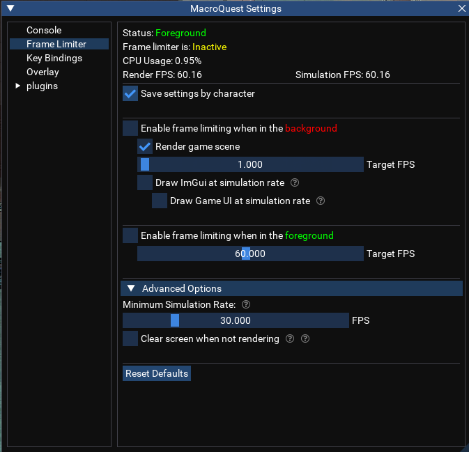

# Frame Limiter

Frame limiter is a built-in feature of MacroQuest that helps control the resource usage of EverQuest by
limiting how often the game renders frames.

## Configuration

Frame lmiter settings can be modified in the MacroQuest Settings window.

## Commands

<a href="../../../reference/commands/framelimiter/">

</a>
:     {{ readMore('reference/commands/framelimiter.md') }}


## Top-Level Objects

## [FrameLimiter](../../reference/top-level-objects/tlo-framelimiter.md)
 {{ readMore('reference/top-level-objects/tlo-framelimiter.md') }}

<h2>Forms</h2>



## Associated DataTypes

## [framelimiter](../../reference/data-types/datatype-framelimiter.md)
 {{ readMore('reference/data-types/datatype-framelimiter.md') }}
:    <h2>Members</h2>
    
     
