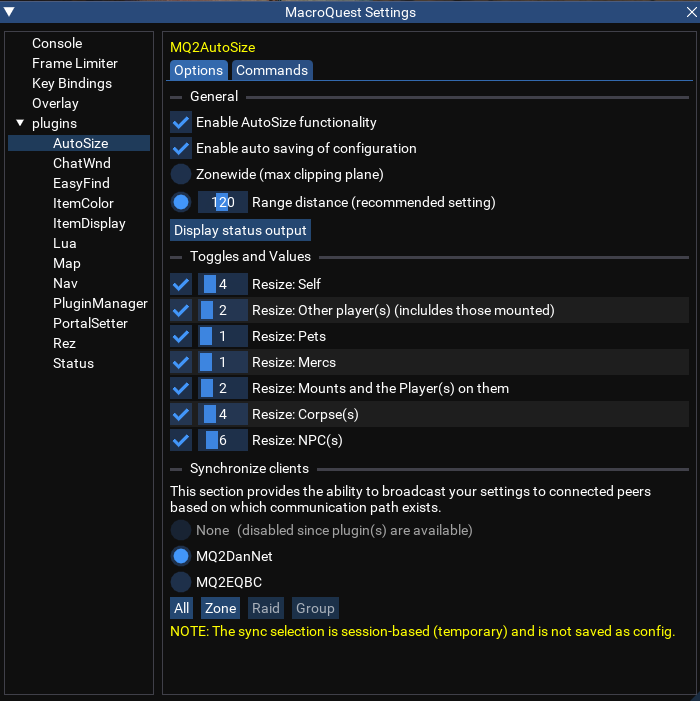

# MQ2AutoSize

## Description

This plugin will automatically shrink everyone within range down to minimum allowed size. They will automatically resize back to normal when they move out of range. (Current range is set at 50' - Can be changed in MQ Settings -> plugin -> AutoSize) 
NOTE: These effects are CLIENT SIDE ONLY! 

You can find the latest version of MQ2AutoSize [here](https://github.com/RedGuides/MQ2AutoSize).

## Commands

`/autosize [on | off]` - Toggles AutoSize functionality or set the functionality on or off directly 
`/autosize [pc | npc | pets | mercs | mounts | corpse | everything | self ] [on | off]` - Toggles AutoSizing for the specified type or set the functionality on or off directly 
`/autosize dist [on | off]` - Toggles distance-based (on) vs Zonewide (off) or set the functionality with on or off. 
`/autosize [ range |  sizepc | sizenpc | sizepets | sizemercs | sizemounts | sizecorpse | sizetarget | sizeself ]  ### (1-250)` 
`/autosize [help | status | autosave | save | load ]` 

## MQSettings

Settings for AutoSize can be modified in MQ Settings -> plugin -> AutoSize

| **Setting** | **Values** | **Description** |
| :---------- | :-------- | :------------- |
| AutoSave | on/off | Whether the plugin should autosave or not |
| ZoneWide/Distance | Distance (50) | Distance-based or zonewide resizing |
| Synchronize Clients | None/MQ2DanNet/MQ2EQBC | Synchronize with other clients |

| **Setting** | **Default Value** | **Default Size Value** | **Description** |
| :---------- | :---------------- | :-------------- | :------------- |
| ResizeSelf | off | 1 | Whether the plugin should resize self and to what size |
| ResizePC | off | 1 | Whether the plugin should resize PCs (including mounted) and to what size |
| ResizePets | off | 1 | Whether the plugin should resize pets and to what size |
| ResizeMercs | off | 1 | Whether the plugin should resize mercanaries and to what size |
| ResizeMounts | off | 1 | Whether the plugin should resize mounts (and the player(s) on them) and to what size |
| ResizeCorpse | off | 1 | Whether the plugin should resize corpses and to what size |
| ResizeNPC | off | 1 | Whether the plugin should resize NPCs and to what size |
| Resize Everything | button | | Sets all resize types to on |

## Top-Level Object: ${AutoSize}

| **Type**                                              | **Member Name**  | **Description**                                            |
| :---------------------------------------------------- | :--------------- | :--------------------------------------------------------- |
| [_bool_](../../reference/data-types/datatype-bool.md) | **Enabled**      | Whether the plugin is enabled or not                       |
| [_bool_](../../reference/data-types/datatype-bool.md) | **AutoSave**     | Whether the plugin should autosave or not                  |
| [_bool_](../../reference/data-types/datatype-bool.md) | **Active**       | Whether the plugin is actively resizing something or not   |
| [_int_](../../reference/data-types/datatype-int.md)   | **Range**        | Distance within which the plugin will resize enabled types |
| [_bool_](../../reference/data-types/datatype-bool.md) | **ResizeCorpse** | Whether the plugin should resize corpses or not            |
| [_bool_](../../reference/data-types/datatype-bool.md) | **ResizeMercs**  | Whether the plugin should resize mercanaries or not        |
| [_bool_](../../reference/data-types/datatype-bool.md) | **ResizeMounts** | Whether the plugin should resize mounts or not             |
| [_bool_](../../reference/data-types/datatype-bool.md) | **ResizeNPC**    | Whether the plugin should resize NPCs or not               |
| [_bool_](../../reference/data-types/datatype-bool.md) | **ResizePC**     | Whether the plugin should resize PCs or not                |
| [_bool_](../../reference/data-types/datatype-bool.md) | **ResizePets**   | Whether the plugin should resize pets or not               |
| [_bool_](../../reference/data-types/datatype-bool.md) | **ResizeSelf**   | Whether the plugin should resize self or not               |
| [_int_](../../reference/data-types/datatype-int.md)   | **SizeCorpse**   | Size of corpses                                            |
| [_int_](../../reference/data-types/datatype-int.md)   | **SizeMercs**    | Size of mercanaries                                        |
| [_int_](../../reference/data-types/datatype-int.md)   | **SizeMounts**   | Size of mounts                                             |
| [_int_](../../reference/data-types/datatype-int.md)   | **SizeNPC**      | Size of NPCs                                               |
| [_int_](../../reference/data-types/datatype-int.md)   | **SizePC**       | Size of PCs                                                |
| [_int_](../../reference/data-types/datatype-int.md)   | **SizePets**     | Size of pets                                               |
| [_int_](../../reference/data-types/datatype-int.md)   | **SizeSelf**     | Size of self                                               |
