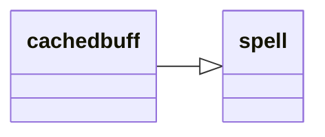

---
tags:
    - datatype
---
# `cachedbuff`

!!! info

    "Cached Buffs" used to be a new way to access buff information on players without needing to re-target them. Now, this functionality
    is fully integrated into MacroQuest and available through the [buff](datatype-buff.md) datatype. As a result, using cached
    buffs is now discouraged.

    You should only used this type if you need access to its "unique" style of buff lookup.

Information about cached buffs on a player. Data must be populated on a player by first targeting them.

See also: [Cached Buffs](../../main/features/cached-buffs.md).

## Inheritance

This type inherits members from [_spell_](datatype-spell.md).



## Members

### [string][string] `CasterName`

:   Returns the name of the caster who applied the buff

### [string][string] `Caster`

:   Same as _CasterName_, added for consistency.

### [int][int] `Count`

:   Returns the amount of buffs catched, or -1 it none

### [int][int] `Duration`

:   Returns the duration of the buff

### [int][int] `OriginalDuration`

:   Original duration of the buff.

### [int][int] `Slot`

:   Returns the buff slot the target had the buff in

### [spell][spell] `Spell`

:   Access the spell.

### [int][int] `SpellID`

:   Returns the buff's spell ID

### [timestamp][timestamp] `Staleness`

:   How long it has been since this information was refreshed.


## Usage

!!! Example

    === "MQScript"

        Check the time left on a group member's buff. Assumes that data has already been populated by targeting them
        at some point in the recent past.

        ```
        /echo ${Group.Member[2].CachedBuff[Spirit of Wolf].Duration}
        ```

    === "Lua"

        Check the time left on a group member's buff. Assumes that data has already been populated by targeting them
        at some point in the recent past.

        ```lua
        print(mq.TLO.Group.Member(2).CachedBuff("Spirit of Wolf").Duration())
        ```

[int]: datatype-int.md
[string]: datatype-string.md
[achievementobj]: datatype-achievementobj.md
[bool]: datatype-bool.md
[time]: datatype-time.md
[achievement]: datatype-achievement.md
[achievementcat]: datatype-achievementcat.md
[altability]: datatype-altability.md
[spell]: datatype-spell.md
[bandolieritem]: #bandolieritem-datatype
[int64]: datatype-int64.md
[timestamp]: datatype-timestamp.md
[float]: datatype-float.md
