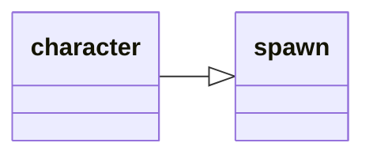

---
tags:
    - datatype
---
# `character`

This data type contains all the information about _your_ character.

## Inheritance

This type inherits members from [_spawn_](datatype-spawn.md).



## Members

The [source](https://github.com/macroquest/macroquest/blob/master/src/main/datatypes/MQ2CharacterType.cpp) always has the latest data members.
If something is missing here, you can check the source to see if it exists.

| Type      | Member              | Description                                        |
|-----------|---------------------|----------------------------------------------------|
| [_int_](datatype-int.md) | **AAExp** | AA exp as a raw number out of 10,000 (10,000=100%) |
| [_int_](datatype-int.md) | **AAPoints** | Unused AA points |
| [_int_](datatype-int.md) | **AAPointsAssigned** | Number of AA Points currently assigned |
| [_int_](datatype-int.md) | **AAPointsSpent** | The number of points you have spent on AA abilities |
| [_int_](datatype-int.md) | **AAPointsTotal** | The total number of AA points you have |
| [_int64_](datatype-int64.md) | **AAVitality** | The total number of AA Vitality you have |
| [_int64_](datatype-int64.md) | **AAVitalityCap** | |
| [_string_](datatype-string.md) | **Ability**[ _name_ ] | Skill name assigned to this doability button |
| [_int_](datatype-int.md) | **Ability**[ _#_ ] | The doability button number that the skill name is on |
| [_bool_](datatype-bool.md) | **AbilityReady**[ _# \| name_ ] | Ability with this name or on this button # ready? |
| | **AbilityTimer** | |
| [_int_](datatype-int.md) | **AccuracyBonus** | Accuracy bonus from gear and spells |
| [_spell_](datatype-spell.md) | **ActiveDisc** | Returns a spell if melee discipline is active. |
| [_int_](datatype-int.md) | **ActiveFavorCost** | If Tribute is active, how much it is costing you every 10 minutes. Returns NULL if tribute is inactive. |
| | **AdoptiveCoin** | |
| [_buff_](datatype-buff.md) | **Aego** | Returns the name of the Aegolism buff or equivalent (Aego, HP Buff, Symbol) from a Cleric. |
| [_spawn_](datatype-spawn.md) | **AggroLock** | Spawn info for aggro lock player |
| [_int_](datatype-int.md) | **AGI** | Character Agility |
| | **AirSupply** | |
| [_altability_](datatype-altability.md) | **AltAbility** [ _# \| name_ ] | Returns the total number of points you have spent in ability # or name |
| [_bool_](datatype-bool.md) | **AltAbilityReady**[ _# \| name_ ] | Alt ability # or name ready? |
| [_int_](datatype-int.md) | **AltAbilityTimer**[ _# \| name_ ] | Alt ability reuse time remaining (in ticks) for ability # or name |
| [_int_](datatype-int.md) | **AltCurrency**[ _name_ ] | The amount of alternate currency given the name (e.g. Marks of Valor) |
| [_bool_](datatype-bool.md) | **AltTimerReady** | Alternate timer ready? (Bash/Slam/Frenzy/Backstab). Note: ${AbilityReady} works fine with most of these.       |
| [_bool_](datatype-bool.md) | **AmIGroupLeader** | Am I the group leader? |
| | **AncientDraconicCoin** | |
| | **AncientSebilisianCoins** | |
| [_bool_](datatype-bool.md) | **AssistComplete** | returns true/false if the assist is complete |
| [_int_](datatype-int.md) | **AttackBonus** | Attack bonus from gear and spells |
| [_int_](datatype-int.md) | **AttackSpeed** | Your Attack Speed. No haste spells/items = AttackSpeed of 100. A 41% haste item will result in an AttackSpeed of 141. This variable does not take into account spell or song haste. |
| [_auratype_](datatype-auratype.md) | **Aura** | Aura data, if an aura is active. |
| [_bool_](datatype-bool.md) | **AutoFire** | Is Autofire on? |
| | **AutoSkill** | |
| [_int_](datatype-int.md) | **AvoidanceBonus** | Avoidance bonus from gear/spells |
| | **Bandolier** | |
| [_item_](datatype-item.md) | **Bank** [ _#_ ] | Item in this bankslot # |
| [_bool_](datatype-bool.md) | **BardSongPlaying** | Is a bard song playing? |
| [_int_](datatype-int.md) | **BaseAGI** | Base Agility |
| [_int_](datatype-int.md) | **BaseCHA** | Base Charisma |
| [_int_](datatype-int.md) | **BaseDEX** | Base Dexterity |
| [_int_](datatype-int.md) | **BaseINT** | Base Intelligence |
| [_int_](datatype-int.md) | **BaseSTA** | Base Stamana |
| [_int_](datatype-int.md) | **BaseSTR** | Base Strength |
| [_int_](datatype-int.md) | **BaseWIS** | Base Wisdom |
| | **BathezidTradeGems** | |
| [_buff_](datatype-buff.md) | **Beneficial** | Returns the first Beneficial buff found in your list of buffs |
| | **BifurcatedCoin** | |
| | **BlockedBuff** | |
| | **BlockedPetBuff** | |
| [_int_](datatype-int.md) | **Book**[ _name_ ] | Slot in your spell book assigned to spell name       |
| [_spell_](datatype-spell.md) | **Book**[ _#_ ] | Spell assigned to this slot # in your spell book |
| [_worldlocation_](datatype-worldlocation.md) | **BoundLocation**[ _#_ ] | Returns information about your bind points (0-4) |
| | **Brellium** | |
| [_buff_](datatype-buff.md) | **Brells** | Returns the Brell's line HP buff from a Paladin |
| | **BronzeFiats** | |
| [_buff_](datatype-buff.md) | **Buff**[ _name_ ] | The buff with this name |
| [_buff_](datatype-buff.md) | **Buff**[ _#_ ] | The buff in this slot # |
| [_bool_](datatype-bool.md) | **CanMount** | Can you use a mount here? |
| [_int64_](datatype-int64.md) | **CareerFavor** | Career favor/tribute |
| [_int64_](datatype-int64.md) | **Cash** | Total cash on your character, expressed in coppers (eg. if you are carrying 100pp, Cash will return 100000) |
| [_int64_](datatype-int64.md) | **CashBank** | Total cash in your bank, expressed in coppers |
| | **CastTimeLeft** | |
| [_int_](datatype-int.md) | **CHA** | Character Charisma |
| | **Charmed** | |
| [_int_](datatype-int.md) | **Chronobines** | Chronobines on your character |
| [_int_](datatype-int.md) | **ClairvoyanceBonus** | Clairvoyance Bonus |
| | **Clarity** | |
| [_bool_](datatype-bool.md) | **Combat** | In combat? |
| [_spell_](datatype-spell.md) | **CombatAbility**[ _#_ ] | The name of Combat Ability # in your list (not the same as anyone else's list!) |
| [_int_](datatype-int.md) | **CombatAbility**[ _name_ ] | The number of Combat ability name in your list (not the same as anyone else's list!) |
| [_bool_](datatype-bool.md) | **CombatAbilityReady**[ _name \| #_ ] | Is this Combat Ability ready? |
| [_int_](datatype-int.md) | **CombatAbilityTimer**[ _name \| #_ ] | The time remaining (in seconds) before the Combat Ability name is usable |
| [_int_](datatype-int.md) | **CombatEffectsBonus** | Combat Effects bonus from gear and spells |
| [_string_](datatype-string.md) | **CombatState** | Returns one of the following: COMBAT, DEBUFFED, COOLDOWN, ACTIVE, RESTING, UNKNOWN |
| | **Commemoratives** | |
| [_int_](datatype-int.md) | **Copper** | Copper on your character |
| [_int_](datatype-int.md) | **CopperBank** | Copper in bank |
| [_spell_](datatype-spell.md) | **Corrupted** | Returns the name of the Corrupted debuff if you have one |
| [_int_](datatype-int.md) | **CountBuffs** | Number of buffs you have, not including short duration buffs |
| [_int64_](datatype-int64.md) | **CountersCorruption** | |
| [_int64_](datatype-int64.md) | **CountersCurse** | Number of curse counters you have |
| [_int64_](datatype-int64.md) | **CountersDisease** | Number of disease counters you have |
| [_int64_](datatype-int64.md) | **CountersPoison** | Number of poison counters you have |
| [_int_](datatype-int.md) | **CountSongs** | Number of songs you have |
| | **Crippled** | |
| | **CrystallizedFear** | |
| | **CryrstallizedLuck** | |
| [_int_](datatype-int.md) | **CurrentEndurance** | Current endurance |
| [_int64_](datatype-int64.md) | **CurrentFavor** | Current favor/tribute |
| [_int_](datatype-int.md) | **CurrentHPs** | Current hit points |
| [_int_](datatype-int.md) | **CurrentMana** | Current mana |
| [_int_](datatype-int.md) | **CurrentWeight** | Current weight |
| [_spell_](datatype-spell.md) | **Cursed** | Returns the name of the Curse debuff if you are effected by one |
| | **CursorCopper** | |
| | **CursorGold** | |
| | **CursorKrono** | |
| | **CursorPlatinum** | |
| | **CursorSilver** | |
| [_int_](datatype-int.md) | **DamageShieldBonus** | Damage Shield bonus from gear and spells |
| [_int_](datatype-int.md) | **DamageShieldMitigationBonus** | Damage Shield Mitigation bonus from gear and spells |
| [_int64_](datatype-int64.md) | **Dar** | Damage absorption remaining (eg. from Rune-type spells) |
| [_int_](datatype-int.md) | **DEX** | Character Dexterity |
| | **DiamondCoins** | |
| [_string_](datatype-string.md) | **Diseased** | Returns the name of first Disease spell on character |
| [_int_](datatype-int.md) | **DoTShieldBonus** | DoT Shield bonus from gear and spells |
| [_string_](datatype-string.md) | **Dotted** | Returns name of first DoT on character |
| [_int_](datatype-int.md) | **Doubloons** | Doubloons on your character |
| [_ticks_](datatype-ticks.md) | **Downtime** | Downtime (Ticks left til combat timer end) |
| | **DreadStones** | |
| [_int_](datatype-int.md) | **Drunk** | Drunkenness level |
| | **DSed** | |
| [_int_](datatype-int.md) | **EbonCrystals** | Number of Ebon Crystals on your character |
| | **Endurance** | |
| [_int_](datatype-int.md) | **EnduranceBonus** | Endurance bonus from gear and spells |
| [_int_](datatype-int.md) | **EnduranceRegen** | Endurance regen from the last tick |
| [_int_](datatype-int.md) | **EnduranceRegenBonus** | Endurance regen bonus |
| | **EnergyCrystals** | |
| | **EntwinedDjinnCoins** | |
| [_int64_](datatype-int64.md) | **Exp** | Experience (out of 10,000) |
| [_int_](datatype-int.md) | **ExpansionFlags** | Returns a numeric number representing which expansions your toon is flagged for |
| [_int_](datatype-int.md) | **Faycites** | Faycites on your character |
| | **Feared** | |
| [_fellowship_](datatype-fellowship.md) | **Fellowship** | Info about Fellowship |
| | **FetteredIfritCoins** | |
| | **FindBuff** | |
| | **Fists** | |
| | **Focus** | |
| [_int_](datatype-int.md) | **FreeBuffSlots** | Number of open buff slots (not counting the short duration buff slots) |
| [_int_](datatype-int.md) | **FreeInventory** | Number of free inventory spaces |
| [_int_](datatype-int.md) | **FreeInventory**[ _#_ ] | Number of free inventory spaces of at least # size (giant=4) |
| | **FroststoneDucat** | |
| [_int_](datatype-int.md) | **Gem**[ _name_ ] | Returns the slot # with the spell name |
| [_spell_](datatype-spell.md) | **Gem**[ _#_ ] | The name of the spell in this slot # |
| [_ticks_](datatype-ticks.md) | **GemTimer**[ _name \| #_ ] | The timer for the spell with this name or in this gem # |
| [_int_](datatype-int.md) | **Gold** | Gold on character |
| [_int_](datatype-int.md) | **GoldBank** | Gold in bank |
| | **GoldTokens** | |
| [_spawn_](datatype-spawn.md) | **GroupAssistTarget** | Current group assist target |
| [_bool_](datatype-bool.md) | **Grouped** | Grouped? |
| [_string_](datatype-string.md) | **GroupList** | Returns a string of your group members (excluding you) |
| [_spawn_](datatype-spawn.md) | **GroupMarkNPC**[ _#_ ] | Current group marked NPC (1-3) |
| [_int_](datatype-int.md) | **GroupSize** | Size of group |
| | **Growth** | |
| [_int_](datatype-int.md) | **GukEarned** | Total LDoN points earned in Deepest Guk |
| [_int64_](datatype-int64.md) | **GuildID** | Returns the ID number of your guild |
| [_int_](datatype-int.md) | **Haste** | Total Combined Haste (worn and spell) as shown in Inventory Window stats |
| | **Hasted** | |
| [_bool_](datatype-bool.md) | **HaveExpansion**[ _#_ ] | Returns TRUE/FALSE if you have that expansion # |
| [_int_](datatype-int.md) | **HealAmountBonus** | Total Heal Amount bonus from gear |
| [_int_](datatype-int.md) | **HeroicAGIBonus** | Total Heroic Agility bonus from gear |
| [_int_](datatype-int.md) | **HeroicCHABonus** | Total Heroic Charisma bonus from gear |
| [_int_](datatype-int.md) | **HeroicDEXBonus** | Total Heroic Dexterity bonus from gear |
| [_int_](datatype-int.md) | **HeroicINTBonus** | Total Heroic Intelligence bonus from gear |
| [_int_](datatype-int.md) | **HeroicSTABonus** | Total Heroic Stamina bonus from gear |
| [_int_](datatype-int.md) | **HeroicSTRBonus** | Total Heroic Strength bonus from gear |
| [_int_](datatype-int.md) | **HeroicWISBonus** | Total Heroic Wisdom bonus from gear |
| [_int_](datatype-int.md) | **HPBonus** | Hit point bonus from gear and spells |
| [_int_](datatype-int.md) | **HPRegen** | Hit point regeneration from last tick |
| [_int_](datatype-int.md) | **HPRegenBonus** | HP regen bonus from gear and spells |
| [_int_](datatype-int.md) | **Hunger** | Hunger level |
| | **HybridHP** | |
| [_int_](datatype-int.md) | **ID** | Spawn ID |
| [_bool_](datatype-bool.md) | **InInstance** | Returns TRUE/FALSE if you are in an instance. |
| | **Instance** | |
| [_int_](datatype-int.md) | **INT** | Character Intelligence |
| [_item_](datatype-item.md) | **Inventory**[ _#_ ] | Item in this slot # |
| [_item_](datatype-item.md) | **Inventory**[ _slotname_ ] |  Item in this slotname (inventory slots only). See [Slot Names](../general/slot-names.md) for a list of slotnames. |
| [_bool_](datatype-bool.md) | **Invited** | Invited to group? |
| [_strinrg_](datatype-string.md) | **Inviter** | Name of player sending group invite |
| [_string_](datatype-string.md) | **Invulnerable** |  Returns the invulnerable spell name on you, can be used with spell data          type ex. ${Me.Invulnerable.Spell.ID} |
| | **IsBerserk** | |
| [_bool_](datatype-bool.md) | **ItemReady**[ _XXX_ ] | True/False on if the item is ready to cast. |
| | **Krono** | |
| [_int_](datatype-int.md) | **LADelegateMA** | Level of Delegate MA of the current group leader (not your own ability level) |
| [_int_](datatype-int.md) | **LADelegateMarkNPC** | Level of Delegate Mark NPC of the current group leader (not your own ability level) |
| [_int_](datatype-int.md) | **LAFindPathPC** | Level of Find Path PC of the current group leader (not your own ability level) |
| [_int_](datatype-int.md) | **LAHealthEnhancement** | Level of Health Enhancement of the current group leader (not your own ability level) |
| [_int_](datatype-int.md) | **LAHealthRegen** | Level of Health Regen of the current group leader (not your own ability level) |
| [_int_](datatype-int.md) | **LAHoTT** | Level of HoTT of the current group leader (not your own ability level) |
| [_int_](datatype-int.md) | **LAInspectBuffs** | Level of Inspect Buffs of the current group leader (not your own ability level) |
| [_int_](datatype-int.md) | **LAManaEnhancement** | Level of Mana Enhancement of the current group leader (not your own ability level) |
| [_int_](datatype-int.md) | **LAMarkNPC** | Level of Mark NPC of the current group leader (not your own ability level) |
| [_int_](datatype-int.md) | **LANPCHealth** | Level of NPC Health of the current group leader (not your own ability level) |
| [_int_](datatype-int.md) | **LAOffenseEnhancement** | Level of Offense Enhancement of the current group leader (not your own ability level) |
| [_int_](datatype-int.md) | **LASpellAwareness** | Level of Spell Awareness of the current group leader (not your own ability level) |
| [_int_](datatype-int.md) | **Language**[_language name_] | The EQ language number of the specified language. See [languages](../general/languages.md). |
| [_string_](datatype-string.md) | **Language**[_language number_] | Returns the EQ language name of the language number specified. See [languages](../general/languages.md). |
| [_int_](datatype-int.md) | **LanguageSkill**[ _language_ ] | Your skill in language |
| [_int_](datatype-int.md) | **LargestFreeInventory** | Size of your largest free inventory space |
| [_int_](datatype-int.md) | **LargestFreeInventory** | Size of your largest free inventory space |
| [_timestamp_](datatype-timestamp.md) | **LastZoned** | Returns a timestamp of last time you zoned |
| | **LCK** | |
| [_int_](datatype-int.md) | **LDoNPoints** | Available LDoN points |
| | **LoyaltyTokens** | |
| | **Maloed** | |
| [_int_](datatype-int.md) | **ManaBonus** | Mana bonus from gear and spells |
| [_int_](datatype-int.md) | **ManaRegen** | Mana regeneration from last tick |
| [_int_](datatype-int.md) | **ManaRegenBonus** | Mana regen bonus from gear and spells |
| | **MarksOfValor** | |
| | **MaxAirSupply** | |
| [_int_](datatype-int.md) | **MaxBuffSlots** | Max number of buffs you can have on you. /echo ${Me.MaxBuffSlots} |
| [_int_](datatype-int.md) | **MaxEndurance** | Max endurance |
| [_int_](datatype-int.md) | **MaxHPs** | Max hit points |
| | **MaxLevel** | |
| [_int_](datatype-int.md) | **MaxMana** | Max mana |
| | **McKenzie** | |
| | **MedalsOfConflict** | |
| | **MedalsOfHeroism** | |
| [_int64_](datatype-int64.md) | **MercAAExp** | |
| | **MercAAPoints* | |
| | **MercAAPointsSpent** | |
| [_string_](datatype-string.md) | **Mercenary** | The state of your Mercenary, ACTIVE, SUSPENDED, or UNKNOWN (If it's dead). Returns NULL if you do not have a Mercenary. |
| [_string_](datatype-string.md) | **MercenaryStance** | Current active mercenary stance as a string, default is NULL. |
| | **MercListInfo** | |
| | **Mezzed** | |
| [_int_](datatype-int.md) | **MirEarned** | Total LDoN points earned in Miragul's |
| [_int_](datatype-int.md) | **MMEarned** | Total LDoN points earned in Mistmoore |
| | **Motes** | |
| [_bool_](datatype-bool.md) | **Moving** | Moving? (including strafe) |
| [_string_](datatype-string.md) | **Name** | First name |
| | **Nobles** | |
| | **NumBagSlots** | |
| [_int_](datatype-int.md) | **NumGems** | Returns the amount of spell gems your toon has |
| | **Origin** | |
| [_int_](datatype-int.md) | **Orux** | Orux on your character |
| | **OverseerTetradrachm** | |
| | **ParcelStatus** | |
| [_float_](datatype-float.md) | **PctAAExp** | AA exp as a % |
| [_int_](datatype-int.md) | **PctAAVitality** | Percentage of AA Vitality your toon has |
| [_int_](datatype-int.md) | **PctAggro** | Your aggro percentage |
| | **PctAirSupply** | |
| [_int_](datatype-int.md) | **PctEndurance** | Current endurance as a % |
| [_float_](datatype-float.md) | **PctExp** | Experience as a % |
| | **PctExpToAA** | |
| [_int_](datatype-int.md) | **PctHPs** | Current HP as a % |
| [_int_](datatype-int.md) | **PctMana** | Current mana as a % |
| | **PctMercAAExp** | |
| [_int_](datatype-int.md) | **PctVitality** | Percentage of Vitality the toon has |
| [_spell_](datatype-spell.md) | **PetBuff**[ _#_ ] | The spell in this PetBuff slot # |
| [_int_](datatype-int.md) | **PetBuff**[ _name_ ] | Finds PetBuff slot with the spell name       |
| [_int_](datatype-int.md) | **Phosphenes** | Phosphenes on your character |
| [_int_](datatype-int.md) | **Phosphites** | Phosphites on your character |
| | **PiecesofEight** | |
| [_int_](datatype-int.md) | **Platinum** | Platinum on your character |
| [_int_](datatype-int.md) | **PlatinumBank** | Platinum in bank |
| [_int_](datatype-int.md) | **PlatinumShared** | Platinum in shared bank |
| [_string_](datatype-string.md) | **Poisoned** | Returns the name of any Poison spell |
| | **PracticePoints** | |
| | **Pred** | |
| [_int_](datatype-int.md) | **RadiantCrystals** | Number of Radiant Crystals on your character |
| [_spawn_](datatype-spawn.md) | **RaidAssistTarget**[ _#_ ] | Current raid assist target (1-3) |
| [_spawn_](datatype-spawn.md) | **RaidMarkNPC**[ _#_ ] | Current raid marked NPC (1-3) |
| [_bool_](datatype-bool.md) | **RangedReady** | Ranged attack ready? |
| | **RebellionChits** | |
| | **Reclamation** | |
| | **Regen** | |
| | **RemnantOfTranquility** | |
| | **RestlessMark** | |
| | **RevDSed** | |
| | **Rooted** | |
| [_int_](datatype-int.md) | **RujEarned** | Total LDoN points earned in Rujarkian |
| [_bool_](datatype-bool.md) | **Running** | Do I have auto-run turned on? |
| | **SathirsTradeGems** | |
| | **ScarletMarks** | |
| | **SE** | |
| [_spawn_](datatype-spawn.md) | **SecondaryAggroPlayer** | spawninfo for secondary aggro player |
| [_int_](datatype-int.md) | **SecondaryPctAggro** | Secondary Percentage aggro |
| | **ShadowStones** | |
| | **SharedBank** | |
| [_int_](datatype-int.md) | **ShieldingBonus** | Shielding bonus from gear and spells |
| | **Shining** | |
| [_bool_](datatype-bool.md) | **Shrouded** | Am I Shrouded? |
| [_buff_](datatype-buff.md) | **Silenced** | Returns the buff of the Silence type effect on you |
| [_int_](datatype-int.md) | **Silver** | Silver on your character |
| [_int_](datatype-int.md) | **SilverBank** | Silver in bank |
| | **SilverTokens** | |
| [_int_](datatype-int.md) | **Skill**[ _name \| #_ ] | Skill level of skill with this name or ID # |
| | **SkillBase** | |
| [_int_](datatype-int.md) | **SkillCap**[ _name \| #_ ] | Skill cap of skill with this name or ID # |
| | **Skin** | |
| | **Slowed** | |
| | **Snared** | |
| [_buff_](datatype-buff.md) | **Song**[ _name_ ] | Finds song with this name |
| [_buff_](datatype-buff.md) | **Song**[ _#_ ] | The song in this slot # |
| | **SPA** | |
| [_spawn_](datatype-spawn.md) | **Spawn** | The character's spawn |
| | **Spell** | |
| [_int_](datatype-int.md) | **SpellDamageBonus** | Spell Damage bonus |
| [_bool_](datatype-bool.md) | **SpellInCooldown** | returns TRUE if you have a spell in cooldown and FALSE when not. |
| [_int_](datatype-int.md) | **SpellRankCap** | your characters spell rank cap. if it returns: 1 = Rk. I spells 2 = Rk. II spells 3 = Rk. III spells |
| [_bool_](datatype-bool.md) | **SpellReady**[ _name \| #_ ] | Gem with this spell name or in this gem # ready to cast? |
| [_int_](datatype-int.md) | **SpellShieldBonus** | Spell Shield bonus from gear and spells |
| [_int_](datatype-int.md) | **STA** | Character Stamina |
| [_int_](datatype-int.md) | **STR** | Character Strength |
| | **Strength** | |
| [_int_](datatype-int.md) | **StrikeThroughBonus** | Strikethrough bonus from gear and spells |
| [_bool_](datatype-bool.md) | **Stunned** | Am I stunned? |
| [_int_](datatype-int.md) | **StunResistBonus** | Stun Resist bonus from gear and spells |
| [_string_](datatype-string.md) | **Subscription** | Subscription type GOLD, FREE, (Silver?) |
| [_int_](datatype-int.md) | **SubscriptionDays** | The number of days left before subscription expires. |
| | **SV** | |
| [_int_](datatype-int.md) | **svChromatic** | Your character's lowest resist |
| [_int_](datatype-int.md) | **svCold** | Character Cold Resist |
| [_int_](datatype-int.md) | **svCorruption** | Character Corruption Resist |
| [_int_](datatype-int.md) | **svDisease** | Character Disease Resist |
| [_int_](datatype-int.md) | **svFire** | Character Fire Resist |
| [_int_](datatype-int.md) | **svMagic** | Character Magic Resist |
| [_int_](datatype-int.md) | **svPoison** | Character Poison Resist |
| [_int_](datatype-int.md) | **svPrismatic** | The average of your character's resists |
| | **Symbol** | |
| [_int_](datatype-int.md) | **TakEarned** | Total LDoN points earned in Takish |
| [_spawn_](datatype-spawn.md) | **TargetOfTarget** | Target of Target (will only work when group or raid Target of Target is active; if not, it will return NULL) |
| | **Tashed** | |
| [_int_](datatype-int.md) | **Thirst** | Thirst level |
| [_int64_](datatype-int64.md) | **TotalCounters** | |
| [_bool_](datatype-bool.md) | **TributeActive** | Tribute Active |
| [_ticks_](datatype-ticks.md) | **TributeTimer** | Tribute Timer |
| [_bool_](datatype-bool.md) | **UseAdvancedLooting** | TRUE/FALSE if using advanced looting |
| | **VeliumShards** | |
| [_int64_](datatype-int64.md) | **Vitality** | Total amount of Vitality your toon has |
| [_int64_](datatype-int64.md) | **VitalityCap** | |
| | **Voucher** | |
| | **WarforgedEmblem** | |
| | **WarlordsSymbol** | |
| [_int_](datatype-int.md) | **WIS** | Character Wisdom |
| [_int_](datatype-int.md) | **XTAggroCount**[ _N_ ] | _N is optional and defaults to 100_.<br><br>Returns the number of AUTO-HATER mobs on the extended target window where your aggro is less than the optional parameter N. N must be between 1-100 inclusive or it will be set to 100 (the default value). |
| [_xtarget_](datatype-xtarget.md) | **XTarget**[ _#_ ] | Extended target data for the specified XTarget #. Note: Passing no index to this returns the number of current extended targets. |
| | **XTargetSlots** | |
| | **XTHaterCount** | |
| | **ZoneBound** | |
| | **ZoneBoundX** | |
| | **ZoneBoundY** | |
| | **ZoneBoundZ** | |
| | **Zoning** | |
| [_string_](datatype-string.md) | **To String** | The character's name |

## Methods

| Name | Action |
| :--- | :--- |
| **Dismount** | Causes character to dismount. |
| **Sit** | Causes character to sit if not already. |
| **Stand** | Causes character to stand if not already. |
| **StopCast** | Causes character to stop casting. |

## Usage

!!! todo

    Add some examples

``` title="MQScript"
/assist PlayerName
/delay 5s ${Me.AssistComplete}==TRUE
```

The delay will last either 5s OR until the assist is complete

