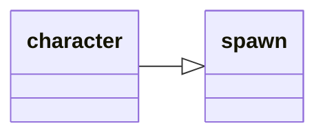

---
tags:
    - datatype
---
# `character`

This data type contains all the information about _your_ character.

## Inheritance

This type inherits members from [_spawn_](datatype-spawn.md).



## Members

The [source](https://github.com/macroquest/macroquest/blob/master/src/main/datatypes/MQ2CharacterType.cpp) always has the latest data members.
If something is missing here, you can check the source to see if it exists.

### [int][int] `AAExp`

:   AA exp as a raw number out of 10,000 (10,000=100%)

### [int][int] `AAPoints`

:   Unused AA points

### [int][int] `AAPointsAssigned`

:   Number of AA Points currently assigned

### [int][int] `AAPointsSpent`

:   The number of points you have spent on AA abilities

### [int][int] `AAPointsTotal`

:   The total number of AA points you have

### [int64][int64] `AAVitality`

:   The total number of AA Vitality you have

### [int64][int64] `AAVitalityCap`

:   

### [string][string] `Ability[name]`

:   Skill name assigned to this doability button

### [int][int] `Ability[#]`

:   The doability button number that the skill name is on

### [bool][bool] `AbilityReady[#|name]`

:   Ability with this name or on this button # ready?

### `AbilityTimer`

:   

### [int][int] `AccuracyBonus`

:   Accuracy bonus from gear and spells

### [spell][spell] `ActiveDisc`

:   Returns a spell if melee discipline is active.

### [int][int] `ActiveFavorCost`

:   If Tribute is active, how much it is costing you every 10 minutes. Returns NULL if tribute is inactive.

### `AdoptiveCoin`

:   

### [buff][buff] `Aego`

:   Returns the name of the Aegolism buff or equivalent (Aego, HP Buff, Symbol) from a Cleric.

### [spawn][spawn] `AggroLock`

:   Spawn info for aggro lock player

### [int][int] `AGI`

:   Character Agility

### `AirSupply`

:   

### [altability][altability] `AltAbility [#|name]`

:   Returns the total number of points you have spent in ability # or name

### [bool][bool] `AltAbilityReady[#|name]`

:   Alt ability # or name ready?

### [int][int] `AltAbilityTimer[#|name]`

:   Alt ability reuse time remaining (in ticks) for ability # or name

### [int][int] `AltCurrency[name]`

:   The amount of alternate currency given the name (e.g. Marks of Valor)

### [bool][bool] `AltTimerReady`

:   Alternate timer ready? (Bash/Slam/Frenzy/Backstab). Note: ${AbilityReady} works fine with most of these.

### [bool][bool] `AmIGroupLeader`

:   Am I the group leader?

### `AncientDraconicCoin`

:   

### `AncientSebilisianCoins`

:   

### [bool][bool] `AssistComplete`

:   returns true/false if the assist is complete

### [int][int] `AttackBonus`

:   Attack bonus from gear and spells

### [int][int] `AttackSpeed`

:   Your Attack Speed. No haste spells/items = AttackSpeed of 100. A 41% haste item will result in an AttackSpeed of 141. This variable does not take into account spell or song haste.

### [auratype][auratype] `Aura`

:   Aura data, if an aura is active.

### [bool][bool] `AutoFire`

:   Is Autofire on?

### `AutoSkill`

:   

### [int][int] `AvoidanceBonus`

:   Avoidance bonus from gear/spells

### `Bandolier`

:   

### [item][item] `Bank [#]`

:   Item in this bankslot #

### [bool][bool] `BardSongPlaying`

:   Is a bard song playing?

### [int][int] `BaseAGI`

:   Base Agility

### [int][int] `BaseCHA`

:   Base Charisma

### [int][int] `BaseDEX`

:   Base Dexterity

### [int][int] `BaseINT`

:   Base Intelligence

### [int][int] `BaseSTA`

:   Base Stamana

### [int][int] `BaseSTR`

:   Base Strength

### [int][int] `BaseWIS`

:   Base Wisdom

### `BathezidTradeGems`

:   

### [buff][buff] `Beneficial`

:   Returns the first Beneficial buff found in your list of buffs

### `BifurcatedCoin`

:   

### `BlockedBuff`

:   

### `BlockedPetBuff`

:   

### [int][int] `Book[name]`

:   Slot in your spell book assigned to spell name

### [spell][spell] `Book[#]`

:   Spell assigned to this slot # in your spell book

### [worldlocation][worldlocation] `BoundLocation[#]`

:   Returns information about your bind points (0-4)

### `Brellium`

:   

### [buff][buff] `Brells`

:   Returns the Brell's line HP buff from a Paladin

### `BronzeFiats`

:   

### [buff][buff] `Buff[name]`

:   The buff with this name

### [buff][buff] `Buff[#]`

:   The buff in this slot #

### [bool][bool] `CanMount`

:   Can you use a mount here?

### [int64][int64] `CareerFavor`

:   Career favor/tribute

### [int64][int64] `Cash`

:   Total cash on your character, expressed in coppers (eg. if you are carrying 100pp, Cash will return 100000)

### [int64][int64] `CashBank`

:   Total cash in your bank, expressed in coppers

### `CastTimeLeft`

:   

### [int][int] `CHA`

:   Character Charisma

### `Charmed`

:   

### [int][int] `Chronobines`

:   Chronobines on your character

### [int][int] `ClairvoyanceBonus`

:   Clairvoyance Bonus

### `Clarity`

:   

### [bool][bool] `Combat`

:   In combat?

### [spell][spell] `CombatAbility[#]`

:   The name of Combat Ability # in your list (not the same as anyone else's list!)

### [int][int] `CombatAbility[name]`

:   The number of Combat ability name in your list (not the same as anyone else's list!)

### [bool][bool] `CombatAbilityReady[name|#]`

:   Is this Combat Ability ready?

### [int][int] `CombatAbilityTimer[name|#]`

:   The time remaining (in seconds) before the Combat Ability name is usable

### [int][int] `CombatEffectsBonus`

:   Combat Effects bonus from gear and spells

### [string][string] `CombatState`

:   Returns one of the following: COMBAT, DEBUFFED, COOLDOWN, ACTIVE, RESTING, UNKNOWN

### `Commemoratives`

:   

### [int][int] `Copper`

:   Copper on your character

### [int][int] `CopperBank`

:   Copper in bank

### [spell][spell] `Corrupted`

:   Returns the name of the Corrupted debuff if you have one

### [int][int] `CountBuffs`

:   Number of buffs you have, not including short duration buffs

### [int64][int64] `CountersCorruption`

:   

### [int64][int64] `CountersCurse`

:   Number of curse counters you have

### [int64][int64] `CountersDisease`

:   Number of disease counters you have

### [int64][int64] `CountersPoison`

:   Number of poison counters you have

### [int][int] `CountSongs`

:   Number of songs you have

### `Crippled`

:   

### `CrystallizedFear`

:   

### `CryrstallizedLuck`

:   

### [int][int] `CurrentEndurance`

:   Current endurance

### [int64][int64] `CurrentFavor`

:   Current favor/tribute

### [int][int] `CurrentHPs`

:   Current hit points

### [int][int] `CurrentMana`

:   Current mana

### [int][int] `CurrentWeight`

:   Current weight

### [spell][spell] `Cursed`

:   Returns the name of the Curse debuff if you are effected by one

### `CursorCopper`

:   

### `CursorGold`

:   

### `CursorKrono`

:   

### `CursorPlatinum`

:   

### `CursorSilver`

:   

### [int][int] `DamageShieldBonus`

:   Damage Shield bonus from gear and spells

### [int][int] `DamageShieldMitigationBonus`

:   Damage Shield Mitigation bonus from gear and spells

### [int64][int64] `Dar`

:   Damage absorption remaining (eg. from Rune-type spells)

### [int][int] `DEX`

:   Character Dexterity

### `DiamondCoins`

:   

### [string][string] `Diseased`

:   Returns the name of first Disease spell on character

### [int][int] `DoTShieldBonus`

:   DoT Shield bonus from gear and spells

### [string][string] `Dotted`

:   Returns name of first DoT on character

### [int][int] `Doubloons`

:   Doubloons on your character

### [ticks][ticks] `Downtime`

:   Downtime (Ticks left til combat timer end)

### `DreadStones`

:   

### [int][int] `Drunk`

:   Drunkenness level

### `DSed`

:   

### [int][int] `EbonCrystals`

:   Number of Ebon Crystals on your character

### `Endurance`

:   

### [int][int] `EnduranceBonus`

:   Endurance bonus from gear and spells

### [int][int] `EnduranceRegen`

:   Endurance regen from the last tick

### [int][int] `EnduranceRegenBonus`

:   Endurance regen bonus

### `EnergyCrystals`

:   

### `EntwinedDjinnCoins`

:   

### [int64][int64] `Exp`

:   Experience (out of 10,000 on Live / out of 330 on Emu)

### [int][int] `ExpansionFlags`

:   Returns a numeric number representing which expansions your toon is flagged for

### [int][int] `Faycites`

:   Faycites on your character

### `Feared`

:   

### [fellowship][fellowship] `Fellowship`

:   Info about Fellowship

### `FetteredIfritCoins`

:   

### `FindBuff`

:   

### `Fists`

:   

### `Focus`

:   

### [int][int] `FreeBuffSlots`

:   Number of open buff slots (not counting the short duration buff slots)

### [int][int] `FreeInventory`

:   Number of free inventory spaces

### [int][int] `FreeInventory[#]`

:   Number of free inventory spaces of at least # size (giant=4)

### `FroststoneDucat`

:   

### [int][int] `Gem[name]`

:   Returns the slot # with the spell name

### [spell][spell] `Gem[#]`

:   The name of the spell in this slot #

### [ticks][ticks] `GemTimer[name|#]`

:   The timer for the spell with this name or in this gem #

### [int][int] `Gold`

:   Gold on character

### [int][int] `GoldBank`

:   Gold in bank

### `GoldTokens`

:   

### [spawn][spawn] `GroupAssistTarget`

:   Current group assist target

### [bool][bool] `Grouped`

:   Grouped?

### [string][string] `GroupList`

:   Returns a string of your group members (excluding you)

### [spawn][spawn] `GroupMarkNPC[#]`

:   Current group marked NPC (1-3)

### [int][int] `GroupSize`

:   Size of group

### `Growth`

:   

### [int][int] `GukEarned`

:   Total LDoN points earned in Deepest Guk

### [int64][int64] `GuildID`

:   Returns the ID number of your guild

### [int][int] `Haste`

:   Total Combined Haste (worn and spell) as shown in Inventory Window stats

### `Hasted`

:   

### [bool][bool] `HaveExpansion[#]`

:   Returns TRUE/FALSE if you have that expansion #

### [int][int] `HealAmountBonus`

:   Total Heal Amount bonus from gear

### [int][int] `HeroicAGIBonus`

:   Total Heroic Agility bonus from gear

### [int][int] `HeroicCHABonus`

:   Total Heroic Charisma bonus from gear

### [int][int] `HeroicDEXBonus`

:   Total Heroic Dexterity bonus from gear

### [int][int] `HeroicINTBonus`

:   Total Heroic Intelligence bonus from gear

### [int][int] `HeroicSTABonus`

:   Total Heroic Stamina bonus from gear

### [int][int] `HeroicSTRBonus`

:   Total Heroic Strength bonus from gear

### [int][int] `HeroicWISBonus`

:   Total Heroic Wisdom bonus from gear

### [int][int] `HPBonus`

:   Hit point bonus from gear and spells

### [int][int] `HPRegen`

:   Hit point regeneration from last tick

### [int][int] `HPRegenBonus`

:   HP regen bonus from gear and spells

### [int][int] `Hunger`

:   Hunger level

### `HybridHP`

:   

### [int][int] `ID`

:   Spawn ID

### [bool][bool] `InInstance`

:   Returns TRUE/FALSE if you are in an instance.

### `Instance`

:   

### [int][int] `INT`

:   Character Intelligence

### [item][item] `Inventory[#]`

:   Item in this slot #

### [item][item] `Inventory[slotname]`

:   Item in this slotname (inventory slots only). See [Slot Names](../general/slot-names.md) for a list of slotnames.

### [bool][bool] `Invited`

:   Invited to group?

### [strinrg][strinrg] `Inviter`

:   Name of player sending group invite

### [string][string] `Invulnerable`

:   Returns the invulnerable spell name on you, can be used with spell data          type ex. ${Me.Invulnerable.Spell.ID}

### `IsBerserk`

:   

### [bool][bool] `ItemReady[XXX]`

:   True/False on if the item is ready to cast.

### `Krono`

:   

### [int][int] `LADelegateMA`

:   Level of Delegate MA of the current group leader (not your own ability level)

### [int][int] `LADelegateMarkNPC`

:   Level of Delegate Mark NPC of the current group leader (not your own ability level)

### [int][int] `LAFindPathPC`

:   Level of Find Path PC of the current group leader (not your own ability level)

### [int][int] `LAHealthEnhancement`

:   Level of Health Enhancement of the current group leader (not your own ability level)

### [int][int] `LAHealthRegen`

:   Level of Health Regen of the current group leader (not your own ability level)

### [int][int] `LAHoTT`

:   Level of HoTT of the current group leader (not your own ability level)

### [int][int] `LAInspectBuffs`

:   Level of Inspect Buffs of the current group leader (not your own ability level)

### [int][int] `LAManaEnhancement`

:   Level of Mana Enhancement of the current group leader (not your own ability level)

### [int][int] `LAMarkNPC`

:   Level of Mark NPC of the current group leader (not your own ability level)

### [int][int] `LANPCHealth`

:   Level of NPC Health of the current group leader (not your own ability level)

### [int][int] `LAOffenseEnhancement`

:   Level of Offense Enhancement of the current group leader (not your own ability level)

### [int][int] `LASpellAwareness`

:   Level of Spell Awareness of the current group leader (not your own ability level)

### [int][int] `Language[language name]`

:   The EQ language number of the specified language. See [languages](../general/languages.md).

### [string][string] `Language[language number]`

:   Returns the EQ language name of the language number specified. See [languages](../general/languages.md).

### [int][int] `LanguageSkill[language]`

:   Your skill in language

### [int][int] `LargestFreeInventory`

:   Size of your largest free inventory space

### [int][int] `LargestFreeInventory`

:   Size of your largest free inventory space

### [timestamp][timestamp] `LastZoned`

:   Returns a timestamp of last time you zoned

### `LCK`

:   

### [int][int] `LDoNPoints`

:   Available LDoN points

### `LoyaltyTokens`

:   

### `Maloed`

:   

### [int][int] `ManaBonus`

:   Mana bonus from gear and spells

### [int][int] `ManaRegen`

:   Mana regeneration from last tick

### [int][int] `ManaRegenBonus`

:   Mana regen bonus from gear and spells

### `MarksOfValor`

:   

### `MaxAirSupply`

:   

### [int][int] `MaxBuffSlots`

:   Max number of buffs you can have on you. /echo ${Me.MaxBuffSlots}

### [int][int] `MaxEndurance`

:   Max endurance

### [int][int] `MaxHPs`

:   Max hit points

### `MaxLevel`

:   

### [int][int] `MaxMana`

:   Max mana

### `McKenzie`

:   

### `MedalsOfConflict`

:   

### `MedalsOfHeroism`

:   

### [string][string] `MembershipLevel`

:   Account membership level: `GOLD`, `SILVER`, `FREE`. All-Access and Lifetime All-access are both considered Gold.

### [int64][int64] `MercAAExp`

:   

### `MercAAPoints`

:   

### `MercAAPointsSpent`

:   

### [string][string] `Mercenary`

:   The state of your Mercenary, ACTIVE, SUSPENDED, or UNKNOWN (If it's dead). Returns NULL if you do not have a Mercenary.

### [string][string] `MercenaryStance`

:   Current active mercenary stance as a string, default is NULL.

### `MercListInfo`

:   

### `Mezzed`

:   

### [int][int] `MirEarned`

:   Total LDoN points earned in Miragul's

### [int][int] `MMEarned`

:   Total LDoN points earned in Mistmoore

### `Motes`

:   

### [bool][bool] `Moving`

:   Moving? (including strafe)

### [string][string] `Name`

:   First name

### `Nobles`

:   

### `NumBagSlots`

:   

### [int][int] `NumGems`

:   Returns the amount of spell gems your toon has

### `Origin`

:   

### [int][int] `Orux`

:   Orux on your character

### `OverseerTetradrachm`

:   

### `ParcelStatus`

:   

### [float][float] `PctAAExp`

:   AA exp as a %

### [int][int] `PctAAVitality`

:   Percentage of AA Vitality your toon has

### [int][int] `PctAggro`

:   Your aggro percentage

### `PctAirSupply`

:   

### [int][int] `PctEndurance`

:   Current endurance as a %

### [float][float] `PctExp`

:   Experience as a %

### `PctExpToAA`

:   

### [int][int] `PctHPs`

:   Current HP as a %

### [int][int] `PctMana`

:   Current mana as a %

### `PctMercAAExp`

:   

### [int][int] `PctVitality`

:   Percentage of Vitality the toon has

### [spell][spell] `PetBuff[#]`

:   The spell in this PetBuff slot #

### [int][int] `PetBuff[name]`

:   Finds PetBuff slot with the spell name

### [int][int] `Phosphenes`

:   Phosphenes on your character

### [int][int] `Phosphites`

:   Phosphites on your character

### `PiecesofEight`

:   

### [int][int] `Platinum`

:   Platinum on your character

### [int][int] `PlatinumBank`

:   Platinum in bank

### [int][int] `PlatinumShared`

:   Platinum in shared bank

### [string][string] `Poisoned`

:   Returns the name of any Poison spell

### `PracticePoints`

:   

### `Pred`

:   

### [int][int] `RadiantCrystals`

:   Number of Radiant Crystals on your character

### [spawn][spawn] `RaidAssistTarget[#]`

:   Current raid assist target (1-3)

### [spawn][spawn] `RaidMarkNPC[#]`

:   Current raid marked NPC (1-3)

### [bool][bool] `RangedReady`

:   Ranged attack ready?

### `RebellionChits`

:   

### `Reclamation`

:   

### `Regen`

:   

### `RemnantOfTranquility`

:   

### `RestlessMark`

:   

### `RevDSed`

:   

### `Rooted`

:   

### [int][int] `RujEarned`

:   Total LDoN points earned in Rujarkian

### [bool][bool] `Running`

:   Do I have auto-run turned on?

### `SathirsTradeGems`

:   

### `ScarletMarks`

:   

### `SE`

:   

### [spawn][spawn] `SecondaryAggroPlayer`

:   spawninfo for secondary aggro player

### [int][int] `SecondaryPctAggro`

:   Secondary Percentage aggro

### `ShadowStones`

:   

### `SharedBank`

:   

### [int][int] `ShieldingBonus`

:   Shielding bonus from gear and spells

### `Shining`

:   

### [bool][bool] `Shrouded`

:   Am I Shrouded?

### [buff][buff] `Silenced`

:   Returns the buff of the Silence type effect on you

### [int][int] `Silver`

:   Silver on your character

### [int][int] `SilverBank`

:   Silver in bank

### `SilverTokens`

:   

### [int][int] `Skill[name|#]`

:   Skill level of skill with this name or ID #

### `SkillBase`

:   

### [int][int] `SkillCap[name|#]`

:   Skill cap of skill with this name or ID #

### `Skin`

:   

### `Slowed`

:   

### `Snared`

:   

### [buff][buff] `Song[name]`

:   Finds song with this name

### [buff][buff] `Song[#]`

:   The song in this slot #

### `SPA`

:   

### [spawn][spawn] `Spawn`

:   The character's spawn

### `Spell`

:   

### [int][int] `SpellDamageBonus`

:   Spell Damage bonus

### [bool][bool] `SpellInCooldown`

:   returns TRUE if you have a spell in cooldown and FALSE when not.

### [int][int] `SpellRankCap`

:   your characters spell rank cap. if it returns: 1 = Rk. I spells 2 = Rk. II spells 3 = Rk. III spells

### [bool][bool] `SpellReady[name|#]`

:   Gem with this spell name or in this gem # ready to cast?

### [int][int] `SpellShieldBonus`

:   Spell Shield bonus from gear and spells

### [int][int] `STA`

:   Character Stamina

### [int][int] `STR`

:   Character Strength

### `Strength`

:   

### [int][int] `StrikeThroughBonus`

:   Strikethrough bonus from gear and spells

### [bool][bool] `Stunned`

:   Am I stunned?

### [int][int] `StunResistBonus`

:   Stun Resist bonus from gear and spells

### [string][string] `Subscription`

:   See MembershipLevel

### [int][int] `SubscriptionDays`

:   The number of days left before subscription expires.

### `SV`

:   

### [int][int] `svChromatic`

:   Your character's lowest resist

### [int][int] `svCold`

:   Character Cold Resist

### [int][int] `svCorruption`

:   Character Corruption Resist

### [int][int] `svDisease`

:   Character Disease Resist

### [int][int] `svFire`

:   Character Fire Resist

### [int][int] `svMagic`

:   Character Magic Resist

### [int][int] `svPoison`

:   Character Poison Resist

### [int][int] `svPrismatic`

:   The average of your character's resists

### `Symbol`

:   

### [int][int] `TakEarned`

:   Total LDoN points earned in Takish

### [spawn][spawn] `TargetOfTarget`

:   Target of Target (will only work when group or raid Target of Target is active; if not, it will return NULL)

### `Tashed`

:   

### [int][int] `Thirst`

:   Thirst level

### [int64][int64] `TotalCounters`

:   

### [bool][bool] `TributeActive`

:   Tribute Active

### [ticks][ticks] `TributeTimer`

:   Tribute Timer

### [bool][bool] `UseAdvancedLooting`

:   TRUE/FALSE if using advanced looting

### `VeliumShards`

:   

### [int64][int64] `Vitality`

:   Total amount of Vitality your toon has

### [int64][int64] `VitalityCap`

:   

### `Voucher`

:   

### `WarforgedEmblem`

:   

### `WarlordsSymbol`

:   

### [int][int] `WIS`

:   Character Wisdom

### [int][int] `XTAggroCount[N]`

:   _N is optional and defaults to 100_.<br><br>Returns the number of AUTO-HATER mobs on the extended target window where your aggro is less than the optional parameter N. N must be between 1-100 inclusive or it will be set to 100 (the default value).

### [xtarget][xtarget] `XTarget[#]`

:   Extended target data for the specified XTarget #. Note: Passing no index to this returns the number of current extended targets.

### `XTargetSlots`

:   

### `XTHaterCount`

:   

### `ZoneBound`

:   

### `ZoneBoundX`

:   

### `ZoneBoundY`

:   

### `ZoneBoundZ`

:   

### `Zoning`

:   

### [string][string] `To String`

:   The character's name


## Methods

| Name | Action |
| :--- | :--- |
| **Dismount** | Causes character to dismount. |
| **Sit** | Causes character to sit if not already. |
| **Stand** | Causes character to stand if not already. |
| **StopCast** | Causes character to stop casting. |

## Usage

!!! todo

    Add some examples

``` title="MQScript"
/assist PlayerName
/delay 5s ${Me.AssistComplete}==TRUE
```

The delay will last either 5s OR until the assist is complete

[int]: datatype-int.md
[string]: datatype-string.md
[achievementobj]: datatype-achievementobj.md
[bool]: datatype-bool.md
[time]: datatype-time.md
[achievement]: datatype-achievement.md
[achievementcat]: datatype-achievementcat.md
[altability]: datatype-altability.md
[spell]: datatype-spell.md
[bandolieritem]: #bandolieritem-datatype
[int64]: datatype-int64.md
[timestamp]: datatype-timestamp.md
[float]: datatype-float.md
[buff]: datatype-buff.md
[spawn]: datatype-spawn.md
[auratype]: datatype-auratype.md
[item]: datatype-item.md
[worldlocation]: datatype-worldlocation.md
[ticks]: datatype-ticks.md
[fellowship]: datatype-fellowship.md
[strinrg]: datatype-string.md
[xtarget]: datatype-xtarget.md
