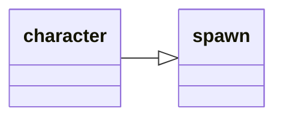

---
tags:
    - datatype
---
# `character`

This data type contains all the information about _your_ character.

## Inheritance

This type inherits members from [_spawn_](datatype-spawn.md).



## Members

The [source](https://github.com/macroquest/macroquest/blob/master/src/main/datatypes/MQ2CharacterType.cpp) always has the latest data members.
If something is missing here, you can check the source to see if it exists.

### {{ renderMember(type='int', name='AAExp') }} 

:   AA exp as a raw number out of 10,000 (10,000=100%)

### {{ renderMember(type='int', name='AAPoints') }} 

:   Unused AA points

### {{ renderMember(type='int', name='AAPointsAssigned') }} 

:   Number of AA Points currently assigned

### {{ renderMember(type='int', name='AAPointsSpent') }} 

:   The number of points you have spent on AA abilities

### {{ renderMember(type='int', name='AAPointsTotal') }} 

:   The total number of AA points you have

### {{ renderMember(type='int64', name='AAVitality') }} 

:   The total number of AA Vitality you have

### {{ renderMember(type='int64', name='AAVitalityCap') }} 

:   

### {{ renderMember(type='string', name='Ability', params='name') }} 

:   Skill name assigned to this doability button

### {{ renderMember(type='bool', name='Ability', params='#|name') }} 

:   Whether you have this ability or not

### {{ renderMember(type='bool', name='AbilityReady', params='#|name') }} 

:   Whether this ability is ready (false if you do not have the ability)

### {{ renderMember(type='timestamp', name='AbilityTimer', params='#|name') }} 

:   How long before an ability can be used again. Zero if it can currently be used or you do not have the ability.  nil if the skill is not an ability or the ability does not exist.

### {{ renderMember(type='timestamp', name='AbilityTimerTotal', params='#|name') }} 

:   The total amount of time an ability takes to refresh. Zero if it is not currently active.

### {{ renderMember(type='int', name='AccuracyBonus') }} 

:   Accuracy bonus from gear and spells

### {{ renderMember(type='spell', name='ActiveDisc') }} 

:   Returns a spell if melee discipline is active.

### {{ renderMember(type='int', name='ActiveFavorCost') }} 

:   If Tribute is active, how much it is costing you every 10 minutes. Returns NULL if tribute is inactive.

### {{ renderMember(name='AdoptiveCoin') }} 

:   

### {{ renderMember(type='buff', name='Aego') }} 

:   Returns the name of the Aegolism buff or equivalent (Aego, HP Buff, Symbol) from a Cleric.

### {{ renderMember(type='spawn', name='AggroLock') }} 

:   Spawn info for aggro lock player

### {{ renderMember(type='int', name='AGI') }} 

:   Character Agility

### {{ renderMember(name='AirSupply') }} 

:   

### {{ renderMember(type='altability', name='AltAbility', params='#|name') }}

:   Returns the total number of points you have spent in ability # or name

### {{ renderMember(type='bool', name='AltAbilityReady', params='#|name') }} 

:   Alt ability # or name ready?

### {{ renderMember(type='int', name='AltAbilityTimer', params='#|name') }} 

:   Alt ability reuse time remaining (in ticks) for ability # or name

### {{ renderMember(type='int', name='AltCurrency', params='name') }} 

:   The amount of alternate currency given the name (e.g. Marks of Valor)

### {{ renderMember(type='bool', name='AltTimerReady') }} 

:   Alternate timer ready? (Bash/Slam/Frenzy/Backstab). Note: ${AbilityReady} works fine with most of these.

### {{ renderMember(type='bool', name='AmIGroupLeader') }} 

:   Am I the group leader?

### {{ renderMember(name='AncientDraconicCoin') }} 

:   

### {{ renderMember(name='AncientSebilisianCoins') }} 

:   

### {{ renderMember(type='bool', name='AssistComplete') }} 

:   returns true/false if the assist is complete

### {{ renderMember(type='int', name='AttackBonus') }} 

:   Attack bonus from gear and spells

### {{ renderMember(type='int', name='AttackSpeed') }} 

:   Your Attack Speed. No haste spells/items = AttackSpeed of 100. A 41% haste item will result in an AttackSpeed of 141. This variable does not take into account spell or song haste.

### {{ renderMember(type='auratype', name='Aura') }} 

:   Aura data, if an aura is active.

### {{ renderMember(type='bool', name='AutoFire') }} 

:   Is Autofire on?

### {{ renderMember(name='AutoSkill') }} 

:   

### {{ renderMember(type='int', name='AvoidanceBonus') }} 

:   Avoidance bonus from gear/spells

### {{ renderMember(name='Bandolier') }} 

:   

### {{ renderMember(type='item', name='Bank') }}

:   Item in this bankslot #

### {{ renderMember(type='bool', name='BardSongPlaying') }} 

:   Is a bard song playing?

### {{ renderMember(type='int', name='BaseAGI') }} 

:   Base Agility

### {{ renderMember(type='int', name='BaseCHA') }} 

:   Base Charisma

### {{ renderMember(type='int', name='BaseDEX') }} 

:   Base Dexterity

### {{ renderMember(type='int', name='BaseINT') }} 

:   Base Intelligence

### {{ renderMember(type='int', name='BaseSTA') }} 

:   Base Stamana

### {{ renderMember(type='int', name='BaseSTR') }} 

:   Base Strength

### {{ renderMember(type='int', name='BaseWIS') }} 

:   Base Wisdom

### {{ renderMember(name='BathezidTradeGems') }} 

:   

### {{ renderMember(type='buff', name='Beneficial') }} 

:   Returns the first Beneficial buff found in your list of buffs

### {{ renderMember(name='BifurcatedCoin') }} 

:   

### {{ renderMember(name='BlockedBuff') }} 

:   

### {{ renderMember(name='BlockedPetBuff') }} 

:   

### {{ renderMember(type='int', name='Book', params='name') }} 

:   Slot in your spell book assigned to spell name

### {{ renderMember(type='spell', name='Book', params='#') }} 

:   Spell assigned to this slot # in your spell book

### {{ renderMember(type='worldlocation', name='BoundLocation', params='#') }} 

:   Returns information about your bind points (0-4)

### {{ renderMember(name='Brellium') }} 

:   

### {{ renderMember(type='buff', name='Brells') }} 

:   Returns the Brell's line HP buff from a Paladin

### {{ renderMember(name='BronzeFiats') }} 

:   

### {{ renderMember(type='buff', name='Buff', params='name') }} 

:   The buff with this name

### {{ renderMember(type='buff', name='Buff', params='#') }} 

:   The buff in this slot #

### {{ renderMember(type='bool', name='CanMount') }} 

:   Can you use a mount here?

### {{ renderMember(type='int64', name='CareerFavor') }} 

:   Career favor/tribute

### {{ renderMember(type='int64', name='Cash') }} 

:   Total cash on your character, expressed in coppers (eg. if you are carrying 100pp, Cash will return 100000)

### {{ renderMember(type='int64', name='CashBank') }} 

:   Total cash in your bank, expressed in coppers

### {{ renderMember(name='CastTimeLeft') }} 

:   

### {{ renderMember(type='int', name='CHA') }} 

:   Character Charisma

### {{ renderMember(name='Charmed') }} 

:   

### {{ renderMember(type='int', name='Chronobines') }} 

:   Chronobines on your character

### {{ renderMember(type='int', name='ClairvoyanceBonus') }} 

:   Clairvoyance Bonus

### {{ renderMember(name='Clarity') }} 

:   

### {{ renderMember(type='bool', name='Combat') }} 

:   In combat?

### {{ renderMember(type='spell', name='CombatAbility', params='#') }} 

:   The name of Combat Ability # in your list (not the same as anyone else's list!)

### {{ renderMember(type='int', name='CombatAbility', params='name') }} 

:   The number of Combat ability name in your list (not the same as anyone else's list!)

### {{ renderMember(type='bool', name='CombatAbilityReady', params='name|#') }} 

:   Is this Combat Ability ready?

### {{ renderMember(type='int', name='CombatAbilityTimer', params='name|#') }} 

:   The time remaining (in seconds) before the Combat Ability name is usable

### {{ renderMember(type='int', name='CombatEffectsBonus') }} 

:   Combat Effects bonus from gear and spells

### {{ renderMember(type='string', name='CombatState') }} 

:   Returns one of the following: COMBAT, DEBUFFED, COOLDOWN, ACTIVE, RESTING, UNKNOWN

### {{ renderMember(name='Commemoratives') }} 

:   

### {{ renderMember(type='int', name='Copper') }} 

:   Copper on your character

### {{ renderMember(type='int', name='CopperBank') }} 

:   Copper in bank

### {{ renderMember(type='spell', name='Corrupted') }} 

:   Returns the name of the Corrupted debuff if you have one

### {{ renderMember(type='int', name='CountBuffs') }} 

:   Number of buffs you have, not including short duration buffs

### {{ renderMember(type='int64', name='CountersCorruption') }} 

:   

### {{ renderMember(type='int64', name='CountersCurse') }} 

:   Number of curse counters you have

### {{ renderMember(type='int64', name='CountersDisease') }} 

:   Number of disease counters you have

### {{ renderMember(type='int64', name='CountersPoison') }} 

:   Number of poison counters you have

### {{ renderMember(type='int', name='CountSongs') }} 

:   Number of songs you have

### {{ renderMember(name='Crippled') }} 

:   

### {{ renderMember(name='CrystallizedFear') }} 

:   

### {{ renderMember(name='CryrstallizedLuck') }} 

:   

### {{ renderMember(type='int', name='CurrentEndurance') }} 

:   Current endurance

### {{ renderMember(type='int64', name='CurrentFavor') }} 

:   Current favor/tribute

### {{ renderMember(type='int', name='CurrentHPs') }} 

:   Current hit points

### {{ renderMember(type='int', name='CurrentMana') }} 

:   Current mana

### {{ renderMember(type='int', name='CurrentWeight') }} 

:   Current weight

### {{ renderMember(type='spell', name='Cursed') }} 

:   Returns the name of the Curse debuff if you are effected by one

### {{ renderMember(name='CursorCopper') }} 

:   

### {{ renderMember(name='CursorGold') }} 

:   

### {{ renderMember(name='CursorKrono') }} 

:   

### {{ renderMember(name='CursorPlatinum') }} 

:   

### {{ renderMember(name='CursorSilver') }} 

:   

### {{ renderMember(type='int', name='DamageShieldBonus') }} 

:   Damage Shield bonus from gear and spells

### {{ renderMember(type='int', name='DamageShieldMitigationBonus') }} 

:   Damage Shield Mitigation bonus from gear and spells

### {{ renderMember(type='int64', name='Dar') }} 

:   Damage absorption remaining (eg. from Rune-type spells)

### {{ renderMember(type='int', name='DEX') }} 

:   Character Dexterity

### {{ renderMember(name='DiamondCoins') }} 

:   

### {{ renderMember(type='string', name='Diseased') }} 

:   Returns the name of first Disease spell on character

### {{ renderMember(type='int', name='DoTShieldBonus') }} 

:   DoT Shield bonus from gear and spells

### {{ renderMember(type='string', name='Dotted') }} 

:   Returns name of first DoT on character

### {{ renderMember(type='int', name='Doubloons') }} 

:   Doubloons on your character

### {{ renderMember(type='ticks', name='Downtime') }} 

:   Downtime (Ticks left til combat timer end)

### {{ renderMember(name='DreadStones') }} 

:   

### {{ renderMember(type='int', name='Drunk') }} 

:   Drunkenness level

### {{ renderMember(name='DSed') }} 

:   

### {{ renderMember(type='int', name='EbonCrystals') }} 

:   Number of Ebon Crystals on your character

### {{ renderMember(name='Endurance') }} 

:   

### {{ renderMember(type='int', name='EnduranceBonus') }} 

:   Endurance bonus from gear and spells

### {{ renderMember(type='int', name='EnduranceRegen') }} 

:   Endurance regen from the last tick

### {{ renderMember(type='int', name='EnduranceRegenBonus') }} 

:   Endurance regen bonus

### {{ renderMember(name='EnergyCrystals') }} 

:   

### {{ renderMember(name='EntwinedDjinnCoins') }} 

:   

### {{ renderMember(type='int64', name='Exp') }} 

:   Experience (out of 10,000 on Live / out of 330 on Emu)

### {{ renderMember(type='int', name='ExpansionFlags') }} 

:   Returns a numeric number representing which expansions your toon is flagged for

### {{ renderMember(type='int', name='Faycites') }} 

:   Faycites on your character

### {{ renderMember(name='Feared') }} 

:   

### {{ renderMember(type='fellowship', name='Fellowship') }} 

:   Info about Fellowship

### {{ renderMember(name='FetteredIfritCoins') }} 

:   

### {{ renderMember(name='FindBuff') }} 

:   

### {{ renderMember(name='Fists') }} 

:   

### {{ renderMember(name='Focus') }} 

:   

### {{ renderMember(type='int', name='FreeBuffSlots') }} 

:   Number of open buff slots (not counting the short duration buff slots)

### {{ renderMember(type='int', name='FreeInventory') }} 

:   Number of free inventory spaces

### {{ renderMember(type='int', name='FreeInventory', params='#') }} 

:   Number of free inventory spaces of at least # size (giant=4)

### {{ renderMember(name='FroststoneDucat') }} 

:   

### {{ renderMember(type='int', name='Gem', params='name') }} 

:   Returns the slot # with the spell name

### {{ renderMember(type='spell', name='Gem', params='#') }} 

:   The name of the spell in this slot #

### {{ renderMember(type='ticks', name='GemTimer', params='name|#') }} 

:   The timer for the spell with this name or in this gem #

### {{ renderMember(type='int', name='Gold') }} 

:   Gold on character

### {{ renderMember(type='int', name='GoldBank') }} 

:   Gold in bank

### {{ renderMember(name='GoldTokens') }} 

:   

### {{ renderMember(type='spawn', name='GroupAssistTarget') }} 

:   Current group assist target

### {{ renderMember(type='bool', name='Grouped') }} 

:   Grouped?

### {{ renderMember(type='string', name='GroupList') }} 

:   Returns a string of your group members (excluding you)

### {{ renderMember(type='spawn', name='GroupMarkNPC', params='#') }} 

:   Current group marked NPC (1-3)

### {{ renderMember(type='int', name='GroupSize') }} 

:   Size of group

### {{ renderMember(name='Growth') }} 

:   

### {{ renderMember(type='int', name='GukEarned') }} 

:   Total LDoN points earned in Deepest Guk

### {{ renderMember(type='int64', name='GuildID') }} 

:   Returns the ID number of your guild

### {{ renderMember(type='int', name='Haste') }} 

:   Total Combined Haste (worn and spell) as shown in Inventory Window stats

### {{ renderMember(name='Hasted') }} 

:   

### {{ renderMember(type='bool', name='HaveExpansion', params='#') }} 

:   Returns TRUE/FALSE if you have that expansion #

### {{ renderMember(type='int', name='HealAmountBonus') }} 

:   Total Heal Amount bonus from gear

### {{ renderMember(type='int', name='HeroicAGIBonus') }} 

:   Total Heroic Agility bonus from gear

### {{ renderMember(type='int', name='HeroicCHABonus') }} 

:   Total Heroic Charisma bonus from gear

### {{ renderMember(type='int', name='HeroicDEXBonus') }} 

:   Total Heroic Dexterity bonus from gear

### {{ renderMember(type='int', name='HeroicINTBonus') }} 

:   Total Heroic Intelligence bonus from gear

### {{ renderMember(type='int', name='HeroicSTABonus') }} 

:   Total Heroic Stamina bonus from gear

### {{ renderMember(type='int', name='HeroicSTRBonus') }} 

:   Total Heroic Strength bonus from gear

### {{ renderMember(type='int', name='HeroicWISBonus') }} 

:   Total Heroic Wisdom bonus from gear

### {{ renderMember(type='int', name='HPBonus') }} 

:   Hit point bonus from gear and spells

### {{ renderMember(type='int', name='HPRegen') }} 

:   Hit point regeneration from last tick

### {{ renderMember(type='int', name='HPRegenBonus') }} 

:   HP regen bonus from gear and spells

### {{ renderMember(type='int', name='Hunger') }} 

:   Hunger level

### {{ renderMember(name='HybridHP') }} 

:   

### {{ renderMember(type='int', name='ID') }} 

:   Spawn ID

### {{ renderMember(type='bool', name='InInstance') }} 

:   Returns TRUE/FALSE if you are in an instance.

### {{ renderMember(name='Instance') }} 

:   

### {{ renderMember(type='int', name='INT') }} 

:   Character Intelligence

### {{ renderMember(type='item', name='Inventory', params='#') }} 

:   Item in this slot #

### {{ renderMember(type='item', name='Inventory', params='slotname') }} 

:   Item in this slotname (inventory slots only). See [Slot Names](../general/slot-names.md) for a list of slotnames.

### {{ renderMember(type='bool', name='Invited') }} 

:   Invited to group?

### {{ renderMember(type='strinrg', name='Inviter') }} 

:   Name of player sending group invite

### {{ renderMember(type='string', name='Invulnerable') }} 

:   Returns the invulnerable spell name on you, can be used with spell data          type ex. ${Me.Invulnerable.Spell.ID}

### {{ renderMember(name='IsBerserk') }} 

:   

### {{ renderMember(type='bool', name='ItemReady', params='XXX') }} 

:   True/False on if the item is ready to cast.

### {{ renderMember(name='Krono') }} 

:   

### {{ renderMember(type='int', name='LADelegateMA') }} 

:   Level of Delegate MA of the current group leader (not your own ability level)

### {{ renderMember(type='int', name='LADelegateMarkNPC') }} 

:   Level of Delegate Mark NPC of the current group leader (not your own ability level)

### {{ renderMember(type='int', name='LAFindPathPC') }} 

:   Level of Find Path PC of the current group leader (not your own ability level)

### {{ renderMember(type='int', name='LAHealthEnhancement') }} 

:   Level of Health Enhancement of the current group leader (not your own ability level)

### {{ renderMember(type='int', name='LAHealthRegen') }} 

:   Level of Health Regen of the current group leader (not your own ability level)

### {{ renderMember(type='int', name='LAHoTT') }} 

:   Level of HoTT of the current group leader (not your own ability level)

### {{ renderMember(type='int', name='LAInspectBuffs') }} 

:   Level of Inspect Buffs of the current group leader (not your own ability level)

### {{ renderMember(type='int', name='LAManaEnhancement') }} 

:   Level of Mana Enhancement of the current group leader (not your own ability level)

### {{ renderMember(type='int', name='LAMarkNPC') }} 

:   Level of Mark NPC of the current group leader (not your own ability level)

### {{ renderMember(type='int', name='LANPCHealth') }} 

:   Level of NPC Health of the current group leader (not your own ability level)

### {{ renderMember(type='int', name='LAOffenseEnhancement') }} 

:   Level of Offense Enhancement of the current group leader (not your own ability level)

### {{ renderMember(type='int', name='LASpellAwareness') }} 

:   Level of Spell Awareness of the current group leader (not your own ability level)

### {{ renderMember(type='int', name='Language', params='language name') }} 

:   The EQ language number of the specified language. See [languages](../general/languages.md).

### {{ renderMember(type='string', name='Language', params='language number') }} 

:   Returns the EQ language name of the language number specified. See [languages](../general/languages.md).

### {{ renderMember(type='int', name='LanguageSkill', params='language') }} 

:   Your skill in language

### {{ renderMember(type='int', name='LargestFreeInventory') }} 

:   Size of your largest free inventory space

### {{ renderMember(type='int', name='LargestFreeInventory') }} 

:   Size of your largest free inventory space

### {{ renderMember(type='timestamp', name='LastZoned') }} 

:   Returns a timestamp of last time you zoned

### {{ renderMember(name='LaurionInnVoucher') }} 

:   

### {{ renderMember(name='LCK') }} 

:   

### {{ renderMember(type='int', name='LDoNPoints') }} 

:   Available LDoN points

### {{ renderMember(name='LoyaltyTokens') }} 

:   

### {{ renderMember(name='Maloed') }} 

:   

### {{ renderMember(type='int', name='ManaBonus') }} 

:   Mana bonus from gear and spells

### {{ renderMember(type='int', name='ManaRegen') }} 

:   Mana regeneration from last tick

### {{ renderMember(type='int', name='ManaRegenBonus') }} 

:   Mana regen bonus from gear and spells

### {{ renderMember(name='MarksOfValor') }} 

:   

### {{ renderMember(name='MaxAirSupply') }} 

:   

### {{ renderMember(type='int', name='MaxBuffSlots') }} 

:   Max number of buffs you can have on you. /echo ${Me.MaxBuffSlots}

### {{ renderMember(type='int', name='MaxEndurance') }} 

:   Max endurance

### {{ renderMember(type='int', name='MaxHPs') }} 

:   Max hit points

### {{ renderMember(name='MaxLevel') }} 

:   

### {{ renderMember(type='int', name='MaxMana') }} 

:   Max mana

### {{ renderMember(name='McKenzie') }} 

:   

### {{ renderMember(name='MedalsOfConflict') }} 

:   

### {{ renderMember(name='MedalsOfHeroism') }} 

:   

### {{ renderMember(type='string', name='MembershipLevel') }} 

:   Account membership level: `GOLD`, `SILVER`, `FREE`. All-Access and Lifetime All-access are both considered Gold.

### {{ renderMember(type='int64', name='MercAAExp') }} 

:   

### {{ renderMember(name='MercAAPoints') }} 

:   

### {{ renderMember(name='MercAAPointsSpent') }} 

:   

### {{ renderMember(type='string', name='Mercenary') }} 

:   The state of your Mercenary, ACTIVE, SUSPENDED, or UNKNOWN (If it's dead). Returns NULL if you do not have a Mercenary.

### {{ renderMember(type='string', name='MercenaryStance') }} 

:   Current active mercenary stance as a string, default is NULL.

### {{ renderMember(name='MercListInfo') }} 

:   

### {{ renderMember(name='Mezzed') }} 

:   

### {{ renderMember(type='int', name='MirEarned') }} 

:   Total LDoN points earned in Miragul's

### {{ renderMember(type='int', name='MMEarned') }} 

:   Total LDoN points earned in Mistmoore

### {{ renderMember(name='Motes') }} 

:   

### {{ renderMember(type='bool', name='Moving') }} 

:   Moving? (including strafe)

### {{ renderMember(type='string', name='Name') }} 

:   First name

### {{ renderMember(name='Nobles') }} 

:   

### {{ renderMember(name='NumBagSlots') }} 

:   

### {{ renderMember(type='int', name='NumGems') }} 

:   Returns the amount of spell gems your toon has

### {{ renderMember(name='Origin') }} 

:   

### {{ renderMember(type='int', name='Orux') }} 

:   Orux on your character

### {{ renderMember(name='OverseerTetradrachm') }} 

:   

### {{ renderMember(name='ParcelStatus') }} 

:   

### {{ renderMember(type='float', name='PctAAExp') }} 

:   AA exp as a %

### {{ renderMember(type='int', name='PctAAVitality') }} 

:   Percentage of AA Vitality your toon has

### {{ renderMember(type='int', name='PctAggro') }} 

:   Your aggro percentage

### {{ renderMember(name='PctAirSupply') }} 

:   

### {{ renderMember(type='int', name='PctEndurance') }} 

:   Current endurance as a %

### {{ renderMember(type='float', name='PctExp') }} 

:   Experience as a %

### {{ renderMember(name='PctExpToAA') }} 

:   

### {{ renderMember(type='int', name='PctHPs') }} 

:   Current HP as a %

### {{ renderMember(type='int', name='PctMana') }} 

:   Current mana as a %

### {{ renderMember(name='PctMercAAExp') }} 

:   

### {{ renderMember(type='int', name='PctVitality') }} 

:   Percentage of Vitality the toon has

### {{ renderMember(type='int', name='PersonaLevel', params='class') }}
:   Given the class shortname as a param, returns level of that class persona. e.g. ${Me.PersonaLevel[DRU]} returns the level of your Druid persona.  If you do not have a Persona of the given class, the member will return 0.

### {{ renderMember(type='spell', name='PetBuff', params='#') }} 

:   The spell in this PetBuff slot #

### {{ renderMember(type='int', name='PetBuff', params='name') }} 

:   Finds PetBuff slot with the spell name

### {{ renderMember(type='int', name='Phosphenes') }} 

:   Phosphenes on your character

### {{ renderMember(type='int', name='Phosphites') }} 

:   Phosphites on your character

### {{ renderMember(name='PiecesofEight') }} 

:   

### {{ renderMember(type='int', name='Platinum') }} 

:   Platinum on your character

### {{ renderMember(type='int', name='PlatinumBank') }} 

:   Platinum in bank

### {{ renderMember(type='int', name='PlatinumShared') }} 

:   Platinum in shared bank

### {{ renderMember(type='string', name='Poisoned') }} 

:   Returns the name of any Poison spell

### {{ renderMember(name='PracticePoints') }} 

:   

### {{ renderMember(name='Pred') }} 

:   

### {{ renderMember(type='int', name='RadiantCrystals') }} 

:   Number of Radiant Crystals on your character

### {{ renderMember(type='spawn', name='RaidAssistTarget', params='#') }} 

:   Current raid assist target (1-3)

### {{ renderMember(type='spawn', name='RaidMarkNPC', params='#') }} 

:   Current raid marked NPC (1-3)

### {{ renderMember(type='bool', name='RangedReady') }} 

:   Ranged attack ready?

### {{ renderMember(name='RebellionChits') }} 

:   

### {{ renderMember(name='Reclamation') }} 

:   

### {{ renderMember(name='Regen') }} 

:   

### {{ renderMember(name='RemnantOfTranquility') }} 

:   

### {{ renderMember(name='RestlessMark') }} 

:   

### {{ renderMember(name='RevDSed') }} 

:   

### {{ renderMember(name='Rooted') }} 

:   

### {{ renderMember(type='int', name='RujEarned') }} 

:   Total LDoN points earned in Rujarkian

### {{ renderMember(type='bool', name='Running') }} 

:   Do I have auto-run turned on?

### {{ renderMember(name='SathirsTradeGems') }} 

:   

### {{ renderMember(name='ScarletMarks') }} 

:   

### {{ renderMember(name='SE') }} 

:   

### {{ renderMember(type='spawn', name='SecondaryAggroPlayer') }} 

:   spawninfo for secondary aggro player

### {{ renderMember(type='int', name='SecondaryPctAggro') }} 

:   Secondary Percentage aggro

### {{ renderMember(name='ShadedSpecie') }} 

:   

### {{ renderMember(name='ShadowStones') }} 

:   

### {{ renderMember(name='ShalowainsPrivateReserve') }}

:   

### {{ renderMember(name='SharedBank') }} 

:   

### {{ renderMember(type='int', name='ShieldingBonus') }} 

:   Shielding bonus from gear and spells

### {{ renderMember(name='Shining') }} 

:   

### {{ renderMember(type='bool', name='Shrouded') }} 

:   Am I Shrouded?

### {{ renderMember(type='buff', name='Silenced') }} 

:   Returns the buff of the Silence type effect on you

### {{ renderMember(type='int', name='Silver') }} 

:   Silver on your character

### {{ renderMember(type='int', name='SilverBank') }} 

:   Silver in bank

### {{ renderMember(name='SilverTokens') }} 

:   

### {{ renderMember(type='int', name='Skill', params='name|#') }} 

:   Skill level of skill with this name or ID #

### {{ renderMember(name='SkillBase') }} 

:   

### {{ renderMember(type='int', name='SkillCap', params='name|#') }} 

:   Skill cap of skill with this name or ID #

### {{ renderMember(name='Skin') }} 

:   

### {{ renderMember(name='Slowed') }} 

:   

### {{ renderMember(name='Snared') }} 

:   

### {{ renderMember(type='buff', name='Song', params='name') }} 

:   Finds song with this name

### {{ renderMember(type='buff', name='Song', params='#') }} 

:   The song in this slot #

### {{ renderMember(name='SPA') }} 

:   

### {{ renderMember(type='spawn', name='Spawn') }} 

:   The character's spawn

### {{ renderMember(name='Spell') }} 

:   

### {{ renderMember(type='int', name='SpellDamageBonus') }} 

:   Spell Damage bonus

### {{ renderMember(type='bool', name='SpellInCooldown') }} 

:   returns TRUE if you have a spell in cooldown and FALSE when not.

### {{ renderMember(type='int', name='SpellRankCap') }} 

:   your characters spell rank cap. if it returns: 1 = Rk. I spells 2 = Rk. II spells 3 = Rk. III spells

### {{ renderMember(type='bool', name='SpellReady', params='name|#') }} 

:   Gem with this spell name or in this gem # ready to cast?

### {{ renderMember(type='int', name='SpellShieldBonus') }} 

:   Spell Shield bonus from gear and spells

### {{ renderMember(name='SpiritualMedallions') }} 

:   

### {{ renderMember(type='int', name='STA') }} 

:   Character Stamina

### {{ renderMember(type='int', name='STR') }} 

:   Character Strength

### {{ renderMember(name='Strength') }} 

:   

### {{ renderMember(type='int', name='StrikeThroughBonus') }} 

:   Strikethrough bonus from gear and spells

### {{ renderMember(type='bool', name='Stunned') }} 

:   Am I stunned?

### {{ renderMember(type='int', name='StunResistBonus') }} 

:   Stun Resist bonus from gear and spells

### {{ renderMember(type='string', name='Subscription') }} 

:   See MembershipLevel

### {{ renderMember(type='int', name='SubscriptionDays') }} 

:   The number of days left before subscription expires.

### {{ renderMember(name='SV') }} 

:   

### {{ renderMember(type='int', name='svChromatic') }} 

:   Your character's lowest resist

### {{ renderMember(type='int', name='svCold') }} 

:   Character Cold Resist

### {{ renderMember(type='int', name='svCorruption') }} 

:   Character Corruption Resist

### {{ renderMember(type='int', name='svDisease') }} 

:   Character Disease Resist

### {{ renderMember(type='int', name='svFire') }} 

:   Character Fire Resist

### {{ renderMember(type='int', name='svMagic') }} 

:   Character Magic Resist

### {{ renderMember(type='int', name='svPoison') }} 

:   Character Poison Resist

### {{ renderMember(type='int', name='svPrismatic') }} 

:   The average of your character's resists

### {{ renderMember(name='Symbol') }} 

:   

### {{ renderMember(type='int', name='TakEarned') }} 

:   Total LDoN points earned in Takish

### {{ renderMember(type='spawn', name='TargetOfTarget') }} 

:   Target of Target (will only work when group or raid Target of Target is active; if not, it will return NULL)

### {{ renderMember(name='Tashed') }} 

:   

### {{ renderMember(type='int', name='Thirst') }} 

:   Thirst level

### {{ renderMember(type='int64', name='TotalCounters') }} 

:   

### {{ renderMember(type='bool', name='TributeActive') }} 

:   Tribute Active

### {{ renderMember(type='ticks', name='TributeTimer') }} 

:   Tribute Timer

### {{ renderMember(type='bool', name='UseAdvancedLooting') }} 

:   TRUE/FALSE if using advanced looting

### {{ renderMember(name='VeliumShards') }} 

:   

### {{ renderMember(type='int64', name='Vitality') }} 

:   Total amount of Vitality your toon has

### {{ renderMember(type='int64', name='VitalityCap') }} 

:   

### {{ renderMember(name='Voucher') }} 

:   

### {{ renderMember(name='WarforgedEmblem') }} 

:   

### {{ renderMember(name='WarlordsSymbol') }} 

:   

### {{ renderMember(type='int', name='WIS') }} 

:   Character Wisdom

### {{ renderMember(type='int', name='XTAggroCount', params='N') }} 

:   _N is optional and defaults to 100_.<br><br>Returns the number of AUTO-HATER mobs on the extended target window where your aggro is less than the optional parameter N. N must be between 1-100 inclusive or it will be set to 100 (the default value).

### {{ renderMember(type='xtarget', name='XTarget', params='#') }} 

:   Extended target data for the specified XTarget #. Note: Passing no index to this returns the number of current extended targets.

### {{ renderMember(name='XTargetSlots') }} 

:   

### {{ renderMember(name='XTHaterCount') }} 

:   

### {{ renderMember(name='ZoneBound') }} 

:   

### {{ renderMember(name='ZoneBoundX') }} 

:   

### {{ renderMember(name='ZoneBoundY') }} 

:   

### {{ renderMember(name='ZoneBoundZ') }} 

:   

### {{ renderMember(name='Zoning') }} 

:   

### [string][string] `To String`

:   The character's name


## Methods

| Name | Action |
| :--- | :--- |
| **Dismount** | Causes character to dismount. |
| **Sit** | Causes character to sit if not already. |
| **Stand** | Causes character to stand if not already. |
| **StopCast** | Causes character to stop casting. |

## Usage

!!! todo

    Add some examples

``` title="MQScript"
/assist PlayerName
/delay 5s ${Me.AssistComplete}==TRUE
```

The delay will last either 5s OR until the assist is complete

[int]: datatype-int.md
[string]: datatype-string.md
[achievementobj]: datatype-achievementobj.md
[bool]: datatype-bool.md
[time]: datatype-time.md
[achievement]: datatype-achievement.md
[achievementcat]: datatype-achievementcat.md
[altability]: datatype-altability.md
[spell]: datatype-spell.md
[bandolieritem]: #bandolieritem-datatype
[int64]: datatype-int64.md
[timestamp]: datatype-timestamp.md
[float]: datatype-float.md
[buff]: datatype-buff.md
[spawn]: datatype-spawn.md
[auratype]: datatype-auratype.md
[item]: datatype-item.md
[worldlocation]: datatype-worldlocation.md
[ticks]: datatype-ticks.md
[fellowship]: datatype-fellowship.md
[strinrg]: datatype-string.md
[xtarget]: datatype-xtarget.md
