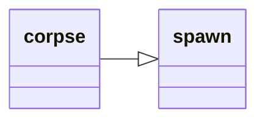

---
tags:
    - datatype
---
# `corpse`

Data related to the current lootable corpse. See [Corpse](../top-level-objects/tlo-corpse.md).

## Inheritance

This type inherits members from [_spawn_](datatype-spawn.md).



## Members

### {{ renderMember(type='item', name='Item', params='N') }}

:   _Nth_ item on the corpse

### [item][item] `Item [name]`

:   Finds an item by partial _name_ in this corpse (use `=<name>` for exact match)

### {{ renderMember(type='int', name='Items') }}

:   Number of items on the corpse

### {{ renderMember(type='bool', name='Open') }}

:   Corpse open?

### [string][string] `To String`

:   Same as **Open**


## Usage

!!! example

    === "MQScript"

        ```
        | Print a message if we have items to loot
        /if (${Corpse.Open} && ${Corpse.Items}) /echo We are currently looting a corpse with items
        ```

    === "Lua"

        ```lua
        -- Print a message if we have items to loot
        if mq.TLO.Corpse.Open() and mq.TLO.Corpse.Items() > 0 then
            print('We are currently looting a corpse with items')
        end
        ```

[bool]: datatype-bool.md
[int]: datatype-int.md
[item]: datatype-item.md
[string]: datatype-string.md
