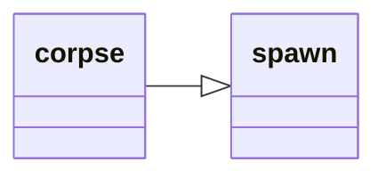

---
tags:
    - datatype
---

# `corpse`

Data related to the current lootable corpse. See [Corpse](../top-level-objects/tlo-corpse.md).

## Inheritance

This type inherits members from [_spawn_](datatype-spawn.md).



## Members

| **Type** | **Member** | **Description** |
| :--- | :--- | :--- |
| [_item_](datatype-item.md) | **Item**[ _N_ ] | _Nth_ item on the corpse |
| [_item_](datatype-item.md) | **Item** [ _name_ ] | Finds an item by partial _name_ in this corpse (use `=<name>` for exact match) |
| [_int_](datatype-int.md) | **Items** | Number of items on the corpse |
| [_bool_](datatype-bool.md) | **Open** | Corpse open? |
| [_string_](datatype-string.md) | **To String** | Same as **Open** |

## Usage

!!! example

    === "MQScript"
    
        ```
        | Print a message if we have items to loot
        /if (${Corpse.Open} && ${Corpse.Items}) /echo We are currently looting a corpse with items
        ```

    === "Lua"

        ```lua
        -- Print a message if we have items to loot
        if mq.TLO.Corpse.Open() and mq.TLO.Corpse.Items() > 0 then
            print('We are currently looting a corpse with items')
        end
        ```
