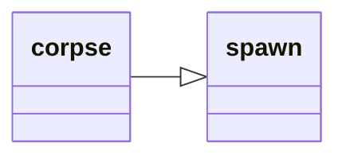

---
tags:
    - datatype
---
# `corpse`

Data related to the current lootable corpse. See [Corpse](../top-level-objects/tlo-corpse.md).

## Inheritance

This type inherits members from [_spawn_](datatype-spawn.md).



## Members

### {{ renderMember(type='item', name='Item', params='N') }} 

:   _Nth_ item on the corpse

### [item][item] `Item [name]`

:   Finds an item by partial _name_ in this corpse (use `=<name>` for exact match)

### {{ renderMember(type='int', name='Items') }} 

:   Number of items on the corpse

### {{ renderMember(type='bool', name='Open') }} 

:   Corpse open?

### [string][string] `To String`

:   Same as **Open**


## Usage

!!! example

    === "MQScript"
    
        ```
        | Print a message if we have items to loot
        /if (${Corpse.Open} && ${Corpse.Items}) /echo We are currently looting a corpse with items
        ```

    === "Lua"

        ```lua
        -- Print a message if we have items to loot
        if mq.TLO.Corpse.Open() and mq.TLO.Corpse.Items() > 0 then
            print('We are currently looting a corpse with items')
        end
        ```
[int]: datatype-int.md
[string]: datatype-string.md
[achievementobj]: datatype-achievementobj.md
[bool]: datatype-bool.md
[time]: datatype-time.md
[achievement]: datatype-achievement.md
[achievementcat]: datatype-achievementcat.md
[altability]: datatype-altability.md
[spell]: datatype-spell.md
[bandolieritem]: #bandolieritem-datatype
[int64]: datatype-int64.md
[timestamp]: datatype-timestamp.md
[float]: datatype-float.md
[buff]: datatype-buff.md
[spawn]: datatype-spawn.md
[auratype]: datatype-auratype.md
[item]: datatype-item.md
[worldlocation]: datatype-worldlocation.md
[ticks]: datatype-ticks.md
[fellowship]: datatype-fellowship.md
[strinrg]: datatype-string.md
[xtarget]: datatype-xtarget.md
