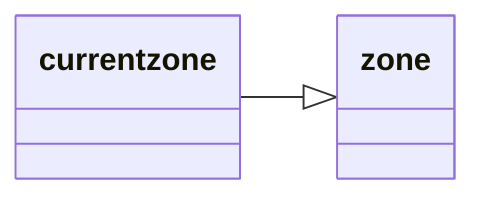

---
tags:
    - datatype
---
# `currentzone`

Extends the [_zone_](datatype-zone.md) type with additional information about the current zone.

## Inheritance

This type inherits members from [_zone_](datatype-zone.md).



## Members

This type inherits members from [_zone_](datatype-zone.md).

### {{ renderMember(type='bool', name='Dungeon') }}

:   Same as Indoor.

### {{ renderMember(type='int', name='ID') }}

:   the ID of the zone.

### {{ renderMember(type='bool', name='Indoor') }}

:   True if this is an Indoor zone.

### {{ renderMember(type='float', name='MaxClip') }}

:   Maximum clip plane allowed in zone.

### {{ renderMember(type='float', name='MinClip') }}

:   Minimum clip plane allowed in zone.

### {{ renderMember(type='string', name='Name') }}

:   Full zone name.

### {{ renderMember(type='bool', name='NoBind') }}

:   True if binding isn't allowed in this zone outside specified bindable areas.

### {{ renderMember(type='bool', name='Outdoor') }}

:   True if this is an outdoor zone.

### {{ renderMember(type='string', name='ShortName') }}

:   Short zone name

### {{ renderMember(type='int', name='Type') }}

:   Zone type

    | Value | Meaning |
    | :--- | :--- |
    | 0 | Indoor Dungeon |
    | 1 | Outdoor |
    | 2 | Outdoor City |
    | 3 | Dungeon City |
    | 4 | Indoor City |
    | 5 | Outdoor Dungeon |

### {{ renderMember(type='int', name='ZoneType') }}

:   Same as Type

### [string][string] `To String`

:   Same as **Name**


## Usage

!!! example

    === "MQScript"

        ```
        | echo if the current zone is indoors:
        /echo ${Zone.Indoor}
        ```

    === "Lua"

        ```lua
        -- echo if the current zone is indoors:
        print(mq.TLO.Zone.Indoor())
        ```

[bool]: datatype-bool.md
[float]: datatype-float.md
[int]: datatype-int.md
[string]: datatype-string.md
