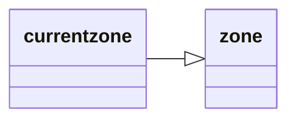

# DataType:currentzone

Contains data about the current zone.

## Inheritance

This type inherits members from [_zone_](datatype-zone.md).



## Members

This type inherits members from [_zone_](datatype-zone.md).

| **Type** | **Member** | **Description** |
| :--- | :--- | :--- |
| [_bool_](datatype-bool.md) | **Dungeon** | Are we in a dungeon |
| [_float_](datatype-float.md) | **Gravity** | Gravity |
| [_int_](datatype-int.md) | **ID** | Zone ID |
| [_bool_](datatype-bool.md) | **Indoor** | Are we indoors? |
| [_float_](datatype-float.md) | **MaxClip** | Maximum clip plane allowed in zone |
| [_float_](datatype-float.md) | **MinClip** | Minimum clip plane allowed in zone |
| [_string_](datatype-string.md) | **Name** | Full zone name |
| [_bool_](datatype-bool.md) | **NoBind** | Can we bind here? |
| [_bool_](datatype-bool.md) | **Outdoor** | Are we outdoors? |
| | **SafeN** | |
| | **SafeU** | |
| | **SafeW** | |
| | **SafeX** | |
| | **SafeY** | |
| | **SafeZ** | |
| [_string_](datatype-string.md) | **ShortName** | Short zone name |
| [_int_](datatype-int.md) | **SkyEnabled** | Sky type |
| [_int_](datatype-int.md) | **Type** | Zone type:0=Indoor Dungeon 1=Outdoor 2=Outdoor City 3=Dungeon City 4=Indoor City 5=Outdoor Dungeon |
| | **ZoneType** | |
| [_string_](datatype-string.md) | **To String** | Same as **Name** |

## Usage

!!! example

    === "MQScript"

        ```
        | echo if the current zone is indoors:
        /echo ${Zone.Indoor}
        ```

    === "Lua"

        ```lua
        -- echo if the current zone is indoors:
        print(mq.TLO.Zone.Indoor())
        ```
