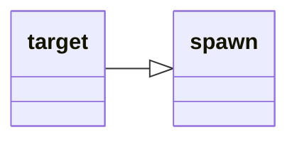

---
tags:
    - datatype
---
# `target`

<!--dt-desc-start-->
This data type represents information specific to your current target. It contains additional members for querying buff information.
<!--dt-desc-end-->
## Inheritance

This type inherits members from [_spawn_](datatype-spawn.md).



## Members
<!--dt-members-start-->
### {{ renderMember(type='cachedbuff', name='Aego') }}

:   Returns the name of the Aego spell if the Target has one

### {{ renderMember(type='spawn', name='AggroHolder') }}

:   Returns the target's current target.

### {{ renderMember(type='cachedbuff', name='Beneficial') }}

:   Returns the name of the Beneficial spell if the Target has one. This will skip "player" casted buffs, but will show NPC Casted buffs and some AA buffs.

### {{ renderMember(type='cachedbuff', name='Brells') }}

:   Returns the name of the Brells spell if the Target has one

### {{ renderMember(type='cachedbuff', name='Charmed') }}

:   Returns the name of the Charmed spell if the Target has one

### {{ renderMember(type='cachedbuff', name='Clarity') }}

:   Returns the name of the Clarity spell if the Target has one

### {{ renderMember(type='cachedbuff', name='Corrupted') }}

:   Returns the name of any the Corruption spell if Target has one

### {{ renderMember(type='cachedbuff', name='Cursed') }}

:   Returns the name of the Curse spell if Target has one

### {{ renderMember(type='cachedbuff', name='Crippled') }}

:   Returns the name of the Cripple spell if the Target has one

### {{ renderMember(type='cachedbuff', name='Diseased') }}

:   Returns the name of a Disease spell if the Target has one

### {{ renderMember(type='cachedbuff', name='Dotted') }}

:   Returns the name of a DOT spell if the Target has one

### {{ renderMember(type='cachedbuff', name='DSed') }}

:   Returns the name of the Damage Shield spell if the Target has one

### {{ renderMember(type='cachedbuff', name='Feared') }}

:   ???

### {{ renderMember(type='cachedbuff', name='Focus') }}

:   Returns the name of the Focus spell if the Target has one

### {{ renderMember(type='cachedbuff', name='Growth') }}

:   Returns the name of the Growth spell if the Target has one

### {{ renderMember(type='cachedbuff', name='Hasted') }}

:   Returns the name of the Haste spell if the Target has one

### {{ renderMember(type='cachedbuff', name='HybridHP') }}

:   Returns the name of the Hybrid HP spell if the Target has one

### {{ renderMember(type='cachedbuff', name='Invulnerable') }}

:   ???

### {{ renderMember(type='cachedbuff', name='Maloed') }}

:   Returns the name of the Malo spell if the Target has one

### {{ renderMember(type='float', name='MaxMeleeTo') }}

:   ???

### {{ renderMember(type='cachedbuff', name='Mezzed') }}

:   Returns the name of the Mez spell if the Target has one

### {{ renderMember(type='int', name='PctAggro') }}

:   ???

### {{ renderMember(type='cachedbuff', name='Poisoned') }}

:   Returns the name of a Poison spell if the Target has one

### {{ renderMember(type='cachedbuff', name='Pred') }}

:   Returns the name of the Predator spell if the Target has one

### {{ renderMember(type='cachedbuff', name='Regen') }}

:   Returns the name of the Regen spell if the Target has one

### {{ renderMember(type='cachedbuff', name='RevDSed') }}

:   Returns the name of the Reverse Damage Shield spell if the Target has one

### {{ renderMember(type='cachedbuff', name='Rooted') }}

:   Returns the name of the Rooted spell if the Target has one

### {{ renderMember(type='cachedbuff', name='SE') }}

:   Returns the name of the Spiritual Enlightenment spell if the Target has one

### {{ renderMember(type='spawn', name='SecondaryAggroPlayer') }}

:   ???

### {{ renderMember(type='int', name='SecondaryPctAggro') }}

:   ???

### {{ renderMember(type='cachedbuff', name='Shining') }}

:   Returns the name of the Shining spell if the Target has one

### {{ renderMember(type='cachedbuff', name='Silenced') }}

:   ???

### {{ renderMember(type='cachedbuff', name='Skin') }}

:   Returns the name of the Skin spell if the Target has one

### {{ renderMember(type='cachedbuff', name='Slowed') }}

:   Returns the name of the Slow spell if the Target has one

### {{ renderMember(type='cachedbuff', name='Snared') }}

:   Returns the name of the Snare spell if the Target has one

### {{ renderMember(type='cachedbuff', name='Strength') }}

:   Returns the name of the Strength spell if the Target has one

### {{ renderMember(type='cachedbuff', name='SV') }}

:   Returns the name of the Spiritual Vitality spell if the Target has one

### {{ renderMember(type='cachedbuff', name='Symbol') }}

:   Returns the name of the Symbol spell if the Target has one

### {{ renderMember(type='cachedbuff', name='Tashed') }}

:   Returns the name of the Tash spell if the Target has one

### [string][string] `(To String)`

:   Same as **Name**
<!--dt-members-end-->

## Examples

```
| The Delay will end when the pet is targeted...AND target buffs are
| populated, or 5 seconds, whichever is shorter.
/target pet
/delay 5s ${Target.ID}==${Pet.ID} && ${Target.BuffsPopulated}==TRUE
```
<!--dt-linkrefs-start-->
[cachedbuff]: datatype-cachedbuff.md
[float]: datatype-float.md
[int]: datatype-int.md
[spawn]: datatype-spawn.md
[string]: datatype-string.md
<!--dt-linkrefs-end-->
