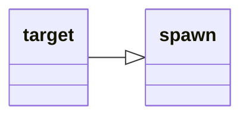

---
tags:
    - datatype
---
# `target`

This data type represents information specific to your current target. It contains additional members for querying buff information.

## Inheritance

This type inherits members from [_spawn_](datatype-spawn.md).



## Members

### [spell][spell] `Aego`

:   Returns the name of the Aego spell if the Target has one

### [spawn][spawn] `AggroHolder`

:   Returns the target's current target.

### [spell][spell] `Beneficial`

:   Returns the name of the Beneficial spell if the Target has one. This will skip "player" casted buffs, but will show NPC Casted buffs and some AA buffs.

### [spell][spell] `Brells`

:   Returns the name of the Brells spell if the Target has one

### [spell][spell] `Charmed`

:   Returns the name of the Charmed spell if the Target has one

### [spell][spell] `Clarity`

:   Returns the name of the Clarity spell if the Target has one

### [spell][spell] `Corrupted`

:   Returns the name of any the Corruption spell if Target has one

### [spell][spell] `Cursed`

:   Returns the name of the Curse spell if Target has one

### [spell][spell] `Crippled`

:   Returns the name of the Cripple spell if the Target has one

### [string][string] `Diseased`

:   Returns the name of a Disease spell if the Target has one

### [string][string] `Dotted`

:   Returns the name of a DOT spell if the Target has one

### [spell][spell] `DSed`

:   Returns the name of the Damage Shield spell if the Target has one

### `Feared`

:   

### [spell][spell] `Focus`

:   Returns the name of the Focus spell if the Target has one

### [spell][spell] `Growth`

:   Returns the name of the Growth spell if the Target has one

### [spell][spell] `Hasted`

:   Returns the name of the Haste spell if the Target has one

### [spell][spell] `HybridHP`

:   Returns the name of the Hybrid HP spell if the Target has one

### `Invulnerable`

:   

### [spell][spell] `Maloed`

:   Returns the name of the Malo spell if the Target has one

### `MaxMeleeTo`

:   

### [spell][spell] `Mezzed`

:   Returns the name of the Mez spell if the Target has one

### `PctAggro`

:   

### [string][string] `Poisoned`

:   Returns the name of a Poison spell if the Target has one

### [spell][spell] `Pred`

:   Returns the name of the Predator spell if the Target has one

### [spell][spell] `Regen`

:   Returns the name of the Regen spell if the Target has one

### [spell][spell] `RevDSed`

:   Returns the name of the Reverse Damage Shield spell if the Target has one

### [spell][spell] `Rooted`

:   Returns the name of the Rooted spell if the Target has one

### [spell][spell] `SE`

:   Returns the name of the Spiritual Enlightenment spell if the Target has one

### `SecondaryAggroPlayer`

:   

### `SecondaryPctAggro`

:   

### [spell][spell] `Shining`

:   Returns the name of the Shining spell if the Target has one

### `Silenced`

:   

### [spell][spell] `Skin`

:   Returns the name of the Skin spell if the Target has one

### [spell][spell] `Slowed`

:   Returns the name of the Slow spell if the Target has one

### [spell][spell] `Snared`

:   Returns the name of the Snare spell if the Target has one

### [spell][spell] `Strength`

:   Returns the name of the Strength spell if the Target has one

### [spell][spell] `SV`

:   Returns the name of the Spiritual Vitality spell if the Target has one

### [spell][spell] `Symbol`

:   Returns the name of the Symbol spell if the Target has one

### [spell][spell] `Tashed`

:   Returns the name of the Tash spell if the Target has one

### [string][string] `(To String)`

:   Same as **Name**


## Examples

```
| The Delay will end when the pet is targeted...AND target buffs are
| populated, or 5 seconds, whichever is shorter.
/target pet
/delay 5s ${Target.ID}==${Pet.ID} && ${Target.BuffsPopulated}==TRUE
```
[int]: datatype-int.md
[string]: datatype-string.md
[achievementobj]: datatype-achievementobj.md
[bool]: datatype-bool.md
[time]: datatype-time.md
[achievement]: datatype-achievement.md
[achievementcat]: datatype-achievementcat.md
[altability]: datatype-altability.md
[spell]: datatype-spell.md
[bandolieritem]: #bandolieritem-datatype
[int64]: datatype-int64.md
[timestamp]: datatype-timestamp.md
[float]: datatype-float.md
[buff]: datatype-buff.md
[spawn]: datatype-spawn.md
[auratype]: datatype-auratype.md
[item]: datatype-item.md
[worldlocation]: datatype-worldlocation.md
[ticks]: datatype-ticks.md
[fellowship]: datatype-fellowship.md
[strinrg]: datatype-string.md
[xtarget]: datatype-xtarget.md
[dzmember]: datatype-dzmember.md
[window]: datatype-window.md
[zone]: datatype-zone.md
[fellowshipmember]: datatype-fellowshipmember.md
[class]: datatype-class.md
[heading]: datatype-heading.md
[ground]: datatype-ground.md
[inifile]: datatype-inifile.md
[inifilesection]: datatype-inifilesection.md
[inifilesectionkey]: datatype-inifilesectionkey.md
[double]: datatype-double.md
[invslot]: datatype-invslot.md
[augtype]: datatype-augtype.md
[itemspell]: datatype-itemspell.md
[evolving]: datatype-evolving.md
[keyringitem]: datatype-keyringitem.md
[raidmember]: datatype-raidmember.md
[body]: datatype-body.md
[cachedbuff]: datatype-cachedbuff.md
[deity]: datatype-deity.md
[race]: datatype-race.md
