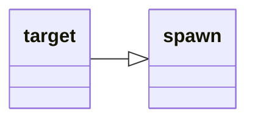

---
tags:
    - ref
    - datatype
---
[TLO List](../top-level-objects/tlo-list.md) | [DataType List](../data-types/datatype-list.md)
# `target`

This data type represents information specific to your current target. It contains additional members for querying buff information.

## Inheritance

This type inherits members from [_spawn_](datatype-spawn.md).



## Members

| **Type** | **Member** | **Description** |
| :--- | :--- | :--- |
| [_spell_](datatype-spell.md) | **Aego** | Returns the name of the Aego spell if the Target has one |
| [_spawn_](datatype-spawn.md) | **AggroHolder** | Returns the target's current target. |
| [_spell_](datatype-spell.md) | **Beneficial** | Returns the name of the Beneficial spell if the Target has one. This will skip "player" casted buffs, but will show NPC Casted buffs and some AA buffs. |
| [_spell_](datatype-spell.md) | **Brells** | Returns the name of the Brells spell if the Target has one |
| [_spell_](datatype-spell.md) | **Charmed** | Returns the name of the Charmed spell if the Target has one |
| [_spell_](datatype-spell.md) | **Clarity** | Returns the name of the Clarity spell if the Target has one |
| [_spell_](datatype-spell.md) | **Corrupted** | Returns the name of any the Corruption spell if Target has one |
| [_spell_](datatype-spell.md) | **Cursed** | Returns the name of the Curse spell if Target has one |
| [_spell_](datatype-spell.md) | **Crippled** | Returns the name of the Cripple spell if the Target has one |
| [_string_](datatype-string.md) | **Diseased** | Returns the name of a Disease spell if the Target has one |
| [_string_](datatype-string.md) | **Dotted** | Returns the name of a DOT spell if the Target has one |
| [_spell_](datatype-spell.md) | **DSed** | Returns the name of the Damage Shield spell if the Target has one |
| | **Feared** | |
| [_spell_](datatype-spell.md) | **Focus** | Returns the name of the Focus spell if the Target has one |
| [_spell_](datatype-spell.md) | **Growth** | Returns the name of the Growth spell if the Target has one |
| [_spell_](datatype-spell.md) | **Hasted** | Returns the name of the Haste spell if the Target has one |
| [_spell_](datatype-spell.md) | **HybridHP** | Returns the name of the Hybrid HP spell if the Target has one |
| | **Invulnerable** | |
| [_spell_](datatype-spell.md) | **Maloed** | Returns the name of the Malo spell if the Target has one |
| | **MaxMeleeTo** | |
| [_spell_](datatype-spell.md) | **Mezzed** | Returns the name of the Mez spell if the Target has one |
| | **PctAggro** | |
| [_string_](datatype-string.md) | **Poisoned** | Returns the name of a Poison spell if the Target has one |
| [_spell_](datatype-spell.md) | **Pred** | Returns the name of the Predator spell if the Target has one |
| [_spell_](datatype-spell.md) | **Regen** | Returns the name of the Regen spell if the Target has one |
| [_spell_](datatype-spell.md) | **RevDSed** | Returns the name of the Reverse Damage Shield spell if the Target has one |
| [_spell_](datatype-spell.md) | **Rooted** | Returns the name of the Rooted spell if the Target has one |
| [_spell_](datatype-spell.md) | **SE** | Returns the name of the Spiritual Enlightenment spell if the Target has one |
| | **SecondaryAggroPlayer** | |
| | **SecondaryPctAggro** | |
| [_spell_](datatype-spell.md) | **Shining** | Returns the name of the Shining spell if the Target has one |
| | **Silenced** | |
| [_spell_](datatype-spell.md) | **Skin** | Returns the name of the Skin spell if the Target has one |
| [_spell_](datatype-spell.md) | **Slowed** | Returns the name of the Slow spell if the Target has one |
| [_spell_](datatype-spell.md) | **Snared** | Returns the name of the Snare spell if the Target has one |
| [_spell_](datatype-spell.md) | **Strength** | Returns the name of the Strength spell if the Target has one |
| [_spell_](datatype-spell.md) | **SV** | Returns the name of the Spiritual Vitality spell if the Target has one |
| [_spell_](datatype-spell.md) | **Symbol** | Returns the name of the Symbol spell if the Target has one |
| [_spell_](datatype-spell.md) | **Tashed** | Returns the name of the Tash spell if the Target has one |
| [_string_](datatype-string.md) | **(To String)** | Same as **Name** |

## Examples

```
| The Delay will end when the pet is targeted...AND target buffs are
| populated, or 5 seconds, whichever is shorter.
/target pet
/delay 5s ${Target.ID}==${Pet.ID} && ${Target.BuffsPopulated}==TRUE
```
